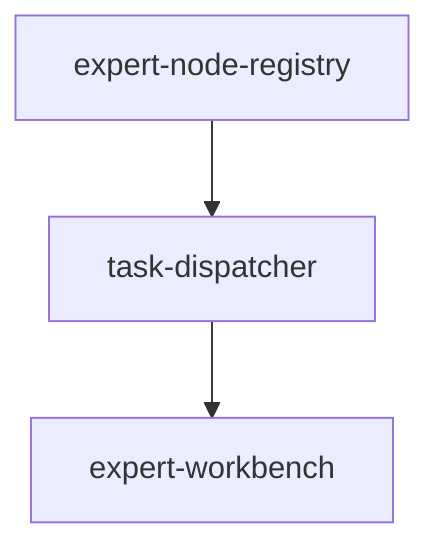

# ETD 规范目录

> **产品**: ETD (Expert Tree Design)  
> **版本**: 1.0.0  
> **状态**: discovered

## 目录结构

```
specs-tree-root/
├── README.md                    # 本文件
├── discovery.md                 # 需求挖掘报告
├── state.json                   # 产品状态
├── specs-tree-expert-node-registry/    # 子 Feature: 专家节点注册
├── specs-tree-task-dispatcher/         # 子 Feature: 任务分配器
└── specs-tree-expert-workbench/        # 子 Feature: 专家工作台
```

## 子 Feature 列表

| Feature ID | 名称 | 优先级 | 状态 |
|-----------|------|--------|------|
| ETD-FR-REGISTRY-001 | 专家节点注册 | P0 | 📝 drafting |
| ETD-FR-DISPATCHER-001 | 任务分配器 | P0 | 📝 drafting |
| ETD-FR-WORKBENCH-001 | 专家工作台 | P1 | 📝 drafting |

## 依赖关系



## 文档导航

- [需求挖掘报告](./discovery.md)
- [产品规范](./spec.md)（待编写）
- [技术规划](./plan.md)（待编写）