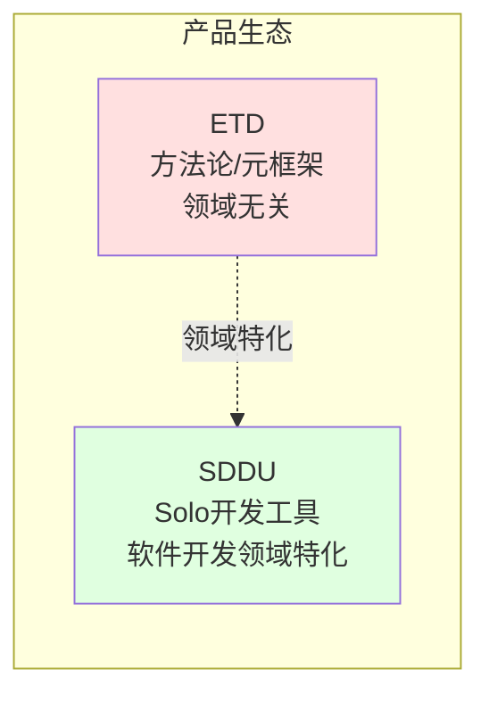
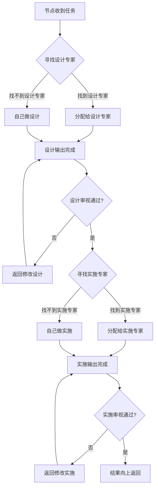
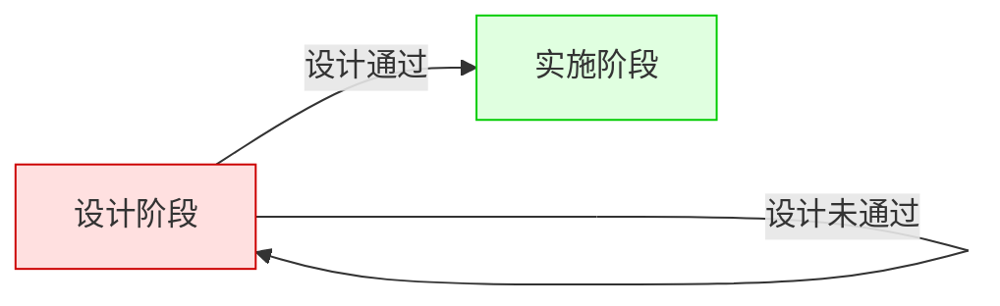
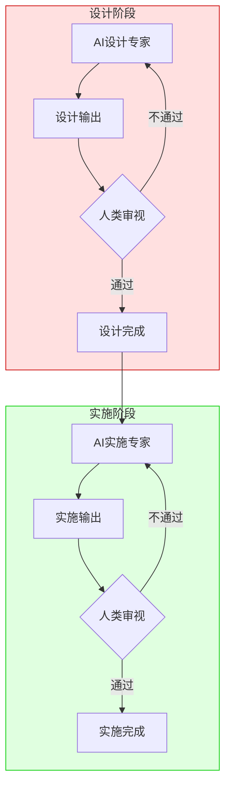
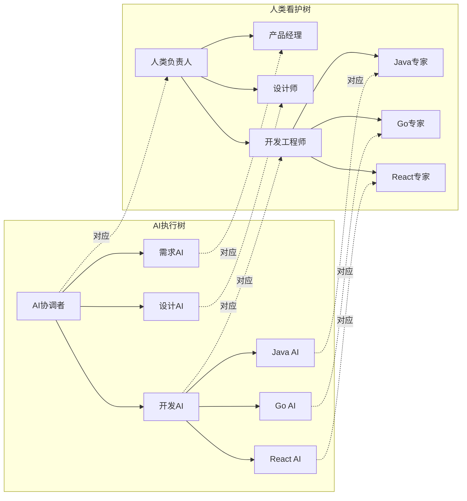
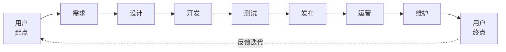
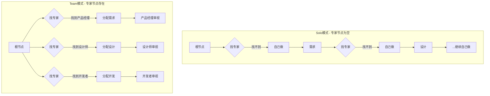
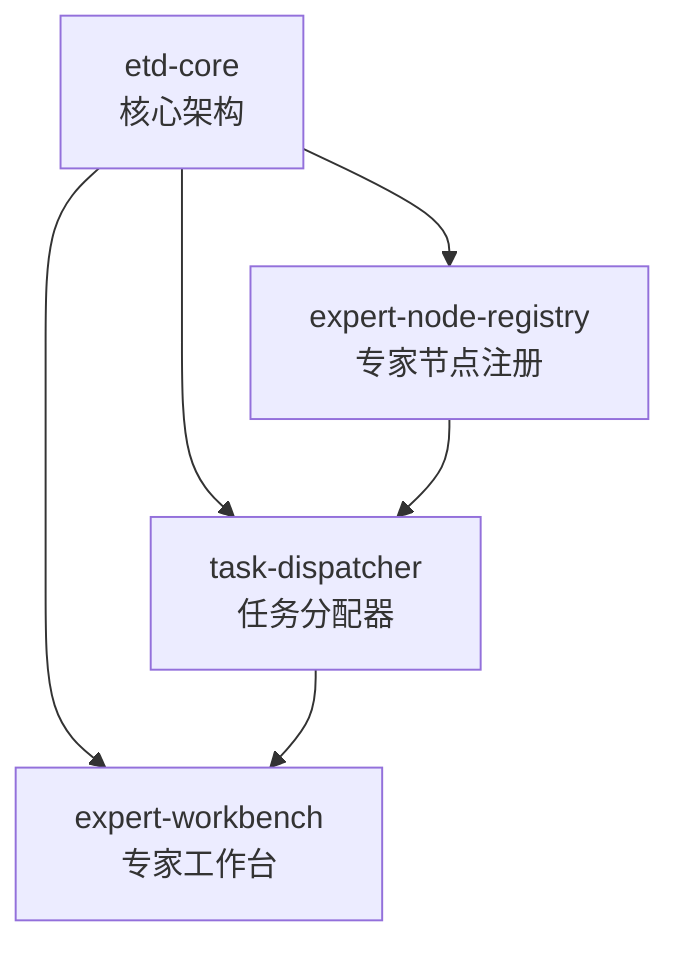

# 需求挖掘报告：ETD (Expert Tree Design)

**Product**: ETD (Expert Tree Design)  
**版本**: 2.0.0  
**创建日期**: 2026-04-18  
**更新日期**: 2026-04-18  
**状态**: discovered  
**优先级**: P0  
**Feature 类型**: 方法论/元框架  
**产品定位**: 动态构建自适应专业协作树的方法论  
**代码仓**: 独立维护

---

## 1. 需求背景

### 为什么需要这个功能

**AI 时代的协作困境：**

AI 能力让复杂任务的执行门槛大幅降低，但"谁来确保 AI 做的对"的问题日益突出。

**核心矛盾：**

| 现状 | 问题 |
|------|------|
| AI 包揽执行 | 缺乏专业审视 = 质量不可控 |
| 引入团队成员后 | 无法让专业的人审视专业的事 |
| 现有工具 | 绑定特定领域或固定流程，无法适配不同场景 |

**本质问题：**

> 不是"如何建一棵固定的树"的问题，而是"如何让树根据现实动态生长"的问题

### 业务价值

- **专业保障**：每个节点的 AI 输出都有对应领域的专业人看护
- **谋定后动**：先思考规划再行动，确保方向正确
- **效率提升**：专业的事交给专业的人/AI，避免一人全包
- **领域通用**：不绑定特定领域，可适用于软件开发、医疗、法律等任意领域
- **质量可控**：AI 执行 + 人类审视 + 谋定后动，三重保障

### 与 SDDU 的关系

| | SDDU | ETD |
|---|------|-----|
| **定位** | Solo 开发者工具 | 方法论/元框架 |
| **架构** | 线性 6 阶段 | 动态树形结构 |
| **核心** | 一人全流程 | 专家分工看护 |
| **领域** | 软件开发专用 | 领域无关 |
| **关系** | 可视为 ETD 在软件开发领域的具体实现 | SDDU 是 ETD 的一个领域特化 |

### 不做的成本

- 一人审视全流程，专业度不足，质量难以保障
- 团队协作依赖人工协调，效率低下
- AI 输出缺乏专业审视，可能偏离真实预期
- 无法复用团队中各岗位的专业能力

---

## 2. 核心原则与目标

### 四大核心原则

| # | 原则 | 核心要义 |
|---|------|---------|
| 1 | **专业分工** | 专业的事交给专业的 AI/人去做 |
| 2 | **设计先行** | 谋定而后动，思考规划先于行动 |
| 3 | **双树并行** | AI 执行树 + 人类看护树，节点一一对应 |
| 4 | **领域无关** | 是方法论而非具体解决方案，不绑定特定领域 |

### 三大目标

| # | 目标层 | 说明 |
|---|--------|------|
| 1 | **动态建树** | 根据现实世界的团队、项目、领域，生成专业协作树 |
| 2 | **演进** | 树是活的，随现实变化生长凋落；非必须时允许人工输入，AI 需要时可介入 |
| 3 | **质量保障** | 每个节点谋定后动，AI 执行 + 人类看护双线并行 |

**一句话目标**：

> **为任意领域的复杂任务，提供一套动态构建专业协作树的方法论，使每个任务在谋定后动的执行与看护中完成。**

### 核心定位

**ETD 是方法论，不是具体解决方案：**

| | 传统工具 | ETD |
|---|---------|-----|
| **定位** | 领域特定解决方案 | 领域无关方法论 |
| **树结构** | 固定预设 | 动态生成 |
| **适用范围** | 特定领域（如软件开发） | 任意领域 |
| **演进方式** | 静态配置 | 活的生长凋落 |

### 与 SDDU 的关系

| | SDDU | ETD |
|---|------|-----|
| **定位** | Solo 开发者工具 | 方法论/元框架 |
| **架构** | 线性 6 阶段 | 动态树形结构 |
| **核心** | 一人全流程 | 专家分工看护 |
| **领域** | 软件开发专用 | 领域无关 |
| **关系** | 可视为 ETD 在软件开发领域的具体实现 | SDDU 是 ETD 的一个领域特化 |

---

## 3. 树形递归分配模型

### 递归逻辑（含设计先行）

**设计先行约束：**

### 双树并行架构

| | AI 执行树 | 人类看护树 |
|---|----------|-----------|
| **职责** | 执行任务 | 审视结果 |
| **原则** | 专业事交给专业 AI | 专业事交给专业人 |
| **根节点** | AI 协调者 | 人类负责人 |
| **专家节点** | 各领域专业 AI Agent | 各领域专业人类角色 |

**设计先行 × 双树并行：**

**注**：每个 AI 专家节点内部也遵循设计先行原则，设计 AI 产出设计方案，实施 AI 产出实施结果，人类对应角色分别审视。

**注**：上图以软件开发领域为例，展示双树并行的结构。树的形态由现实世界动态生成，不绑定特定领域。

---

## 4. 示例：软件开发领域的专家树

> 本节以软件开发领域为例，展示 ETD 方法论在特定领域的具体形态。**这不是 ETD 的固定结构，而是领域特化的一个示例。**

### 生命周期定义

### 专家节点树形结构

```mermaid
flowchart TD
    ROOT[根节点<br>AI协调者 / 人类负责人] --> REQ[需求专家]
    ROOT --> DES[设计专家]
    ROOT --> DEV[开发专家]
    ROOT --> TEST[测试专家]
    ROOT --> PUB[发布专家]
    ROOT --> OPS[运营专家]
    ROOT --> MNT[维护专家]
    
    REQ --> REQ1[用户研究专家]
    REQ --> REQ2[竞品分析专家]
    REQ --> REQ3[需求文档专家]
    
    DES --> DES1[产品设计专家]
    DES --> DES2[交互设计专家]
    DES --> DES3[视觉设计专家]
    DES --> DES4[架构设计专家]
    DES4 --> DES4A[前端架构专家]
    DES4 --> DES4B[后端架构专家]
    DES4 --> DES4C[数据架构专家]
    
    DEV --> DEV1[前端开发专家]
    DEV --> DEV2[后端开发专家]
    DEV --> DEV3[移动端开发专家]
    DEV --> DEV4[数据库开发专家]
    
    DEV1 --> DEV1A[React专家]
    DEV1 --> DEV1B[Vue专家]
    DEV1 --> DEV1C[小程序专家]
    
    DEV2 --> DEV2A[Java专家]
    DEV2 --> DEV2B[Go专家]
    DEV2 --> DEV2C[Python专家]
    DEV2 --> DEV2D[Node.js专家]
    
    DEV3 --> DEV3A[iOS专家]
    DEV3 --> DEV3B[Android专家]
    
    DEV4 --> DEV4A[MySQL专家]
    DEV4 --> DEV4B[PostgreSQL专家]
    DEV4 --> DEV4C[MongoDB专家]
    
    TEST --> TEST1[功能测试专家]
    TEST --> TEST2[性能测试专家]
    TEST --> TEST3[安全测试专家]
    TEST --> TEST4[自动化测试专家]
    
    PUB --> PUB1[部署专家]
    PUB --> PUB2[监控专家]
    PUB1 --> PUB1A[Docker专家]
    PUB1 --> PUB1B[K8s专家]
    PUB1 --> PUB1C[云平台专家]
    
    OPS --> OPS1[数据分析专家]
    OPS --> OPS2[用户增长专家]
    
    MNT --> MNT1[Bug修复专家]
    MNT --> MNT2[技术债专家]
```

### 生命周期 × AI输出 × 人类审视

| 生命周期 | AI 设计输出 | 人类审视角色 | AI 实施输出 | 人类审视角色 |
|---------|-----------|-------------|-----------|-------------|
| **需求** | 需求文档、用户故事、优先级 | 产品经理 | 用户调研报告、竞品分析 | 用户研究员 |
| **设计** | 产品设计稿、交互稿、架构方案 | 产品设计师、UX设计师、架构师 | 视觉稿、数据模型、原型 | UI设计师、数据库设计师 |
| **开发** | 技术方案、代码架构 | 技术负责人 | 代码、接口实现、数据库脚本 | 前端工程师、后端工程师 |
| **测试** | 测试用例、测试方案 | 测试负责人 | 测试报告、缺陷报告 | 测试工程师 |
| **发布** | 发布方案、回滚预案 | 发布负责人 | 部署结果、监控配置 | 运维工程师、SRE |
| **运营** | 运营策略、增长方案 | 运营负责人 | 数据分析报告、用户反馈报告 | 数据分析师 |
| **维护** | 维护计划、优先级排序 | 技术负责人 | Bug修复代码、技术债处理结果 | 开发工程师 |

---

## 5. Solo vs Team 的本质

### 对比

| | Solo | Team |
|---|------|------|
| **定义** | 根节点找不到下级专家 → 自己做/看全流程 | 根节点找到下级专家 → 分配给专家 |
| **差异** | 专家节点为空 | 专家节点存在 |
| **过渡** | 不是模式切换，而是引入专家节点 |

**一句话定义：**

> Solo = 专家节点为空时的特例  
> Team = 专家节点存在时的常态

---

## 6. Feature 结构设计

### 父 Feature: etd-core

**职责**: 构建动态建树的方法论和运行时支撑

### 子 Feature 结构

### 子 Feature 1: expert-node-registry（专家节点注册）

**Feature ID**: ETD-FR-REGISTRY-001  
**职责**: 管理专家节点的注册、发现、匹配  

**关键能力**:

- 专家节点注册（AI Agent / 人类角色）
- 按领域 × 能力维度匹配专家
- 专家节点层级管理（L0/L1/L2/L3）
- 专家能力声明与认证

### 子 Feature 2: task-dispatcher（任务分配器）

**Feature ID**: ETD-FR-DISPATCHER-001  
**职责**: 实现"先找专家，找不到才自己做"的递归分配逻辑  

**关键能力**:

- 任务解析与专家匹配
- 递归向下分配
- 结果向上汇聚
- 支持 AI 执行树 + 人类看护树双树

### 子 Feature 3: expert-workbench（专家工作台）

**Feature ID**: ETD-FR-WORKBENCH-001  
**职责**: 每个专家节点的工作界面  

**关键能力**:

- 接收分配的任务
- 继续向下找专家 / 自己处理
- 提交结果
- CLI + Web 界面

---

## 7. 领域适配示例

ETD 作为方法论，可适配多种领域：

| 领域 | 专家类型示例 | 任务类型示例 |
|------|-------------|-------------|
| **软件开发** | 产品经理、设计师、开发工程师、测试工程师... | 需求分析、架构设计、编码实现、测试验证... |
| **医疗诊断** | 医生、护士、技师、药师... | 问诊、检查、诊断、治疗... |
| **法律诉讼** | 律师、法官、书记员、专家证人... | 咨询、起诉、辩护、判决... |
| **教育培训** | 教师、辅导员、教研员... | 备课、授课、辅导、评估... |

**领域适配要点**：

1. **定义领域专家类型**：分析该领域需要的专业角色
2. **定义任务分解方式**：确定任务在该领域的拆分粒度
3. **建立匹配规则**：定义任务与专家的匹配逻辑
4. **设定审视流程**：确定人类看护树的审视节点

---

## 8. 用户价值

| 角色 | 价值 |
|------|------|
| **Solo 执行者** | 一人搞定全流程，未来可平滑引入专家节点 |
| **团队负责人** | 任务分配给对应专家，无需人工协调 |
| **专业角色** | 只看护自己专业领域的 AI 输出 |
| **跨领域用户** | 同一套方法论适配不同领域，学习成本低 |

---

## 9. 技术方向

- **元模型设计**：定义专家、任务、匹配、组织、演进的抽象规则
- **动态建树**：根据现实模型生成专业协作树
- **树形递归**：基于递归分配的专家节点树
- **设计先行**：每个节点遵循谋定后动原则
- **双树并行**：AI 执行树 + 人类看护树，节点一一对应
- **演进机制**：支持树的生长、凋落、人工干预

---

## 10. 风险与限制

| 风险 | 等级 | 缓解措施 |
|------|------|---------|
| 专家节点匹配精度不足 | 🔴 高 | 建立专家能力声明体系，支持人工干预 |
| 树形结构层级过深 | 🟡 中 | 限制最大层级（如 ≤5），提供扁平化视图 |
| AI 执行树与人类看护树同步 | 🟡 中 | 节点一一对应，状态实时同步 |
| 领域适配成本 | 🟡 中 | 提供领域模板，降低适配门槛 |
| 元模型抽象过度 | 🟡 中 | 保持元模型精简，避免过度设计 |
| 专家节点动态变更 | 🟡 中 | 支持热注册/注销，缓存失效机制 |

---

## 11. 待澄清问题

1. **现实模型来源**：现实模型（团队、项目、领域）从哪里来？人工描述还是系统感知？
2. **树的生成时机**：树是项目启动时一次性生成，还是持续演进？
3. **元模型抽象**：专家、任务、匹配、组织、演进——这五个抽象是否足够？
4. **领域模板机制**：是否需要为不同领域提供预设模板？如何平衡模板与动态生成？
5. **演进的人工干预**：树的演进中，人工干预的边界是什么？哪些必须人工决策？

---

## 12. 下一步建议

### 推荐流程

1. ✅ 需求挖掘完成（当前阶段）
2. ✅ 创建 ETD 独立代码仓库
3. ✅ 迁移 discovery 文档至新仓库
4. 👉 为 ETD 编写产品规范（spec）
5. 👉 制定技术规划和任务分解

### 规范编写重点关注

- 元模型设计（专家、任务、匹配、组织、演进的抽象规则）
- 动态建树机制设计
- 递归分配算法设计
- AI 执行树与人类看护树的同步机制
- 演进机制（生长、凋落、人工干预）设计
- 领域适配方案

---

## 13. 产品命名说明

**ETD = Expert Tree Design**

| 字母 | 含义 | 核心特点 |
|------|------|---------|
| **E**xpert | 专家分工 | 专业的事交给专业的 AI/人去做 |
| **T**ree | 动态协作树 | 根据现实模型动态生成，可生长凋落 |
| **D**esign | 设计先行 | 谋定而后动，思考规划先于行动 |

**产品副标题**: AI执行 × 人类看护

**产品定位**: ETD 是一套领域无关的方法论，为任意领域的复杂任务提供动态构建专业协作树的机制，实现专家分工看护和谋定后动约束。

---

**需求挖掘完成时间**: 2026-04-18  
**需求挖掘更新时间**: 2026-04-18  
**需求挖掘状态**: discovered  
**版本**: v2.0.0  
**下一步**: 为 ETD 编写产品规范（spec）