# 需求挖掘报告：ETD (Expert Tree Design)

**Product**: ETD (Expert Tree Design)  
**版本**: 2.1.0  
**创建日期**: 2026-04-18  
**更新日期**: 2026-04-18  
**状态**: discovered  
**优先级**: P0  
**Feature 类型**: 方法论/元框架  
**产品定位**: 动态构建专业协作树的方法论  
**代码仓**: 独立维护

---

## 1. 需求背景

### 为什么需要这个功能

**AI 时代的协作困境：**

AI 能力让复杂任务的执行门槛大幅降低，但"谁来确保 AI 做的对"的问题日益突出。

**核心矛盾：**

| 现状 | 问题 |
|------|------|
| AI 包揽执行 | 缺乏专业审视 = 质量不可控 |
| 引入团队成员后 | 无法让专业的人审视专业的事 |
| 现有工具 | 绑定特定领域或固定流程，无法适配不同场景 |

**本质问题：**

> 不是"如何建一棵固定的树"的问题，而是"如何让树根据现实动态生长"的问题

### 业务价值

- **专业保障**：每个节点的 AI 输出都有对应领域的专业人看护
- **谋定后动**：先思考规划再行动，确保方向正确
- **效率提升**：专业的事交给专业的人/AI，避免一人全包
- **领域通用**：不绑定特定领域，可适用于软件开发、医疗、法律等任意领域
- **质量可控**：AI 执行 + 人类审视 + 谋定后动，三重保障

### 与 SDDU 的关系

| | SDDU | ETD |
|---|------|-----|
| **定位** | Solo 开发者工具 | 方法论/元框架 |
| **架构** | 线性 6 阶段 | 动态树形结构 |
| **核心** | 一人全流程 | 专家分工看护 |
| **领域** | 软件开发专用 | 领域无关 |
| **关系** | 可视为 ETD 在软件开发领域的具体实现 | SDDU 是 ETD 的一个领域特化 |

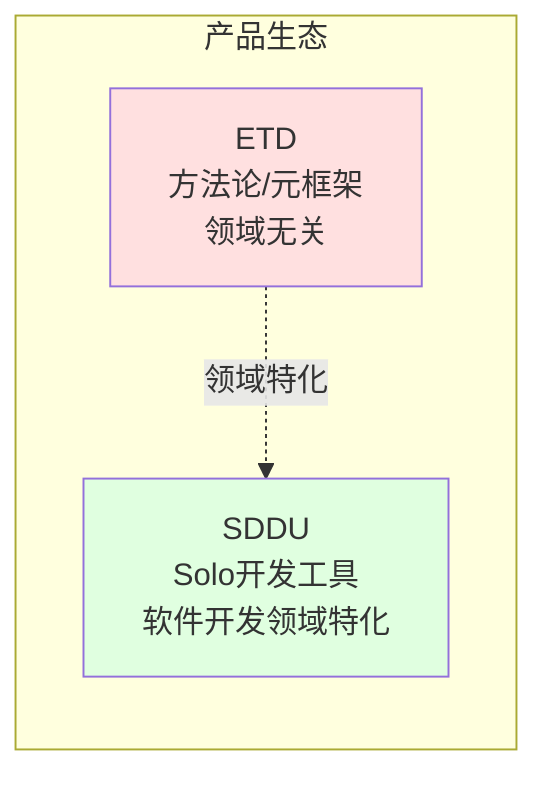

### 不做的成本

- 一人审视全流程，专业度不足，质量难以保障
- 团队协作依赖人工协调，效率低下
- AI 输出缺乏专业审视，可能偏离真实预期
- 无法复用团队中各岗位的专业能力

---

## 2. 核心原则与目标

### 2.1 问题到原则的推导

ETD 解决的核心问题是：

> **如何让复杂任务在专业保障下高质量完成？**

从这个核心问题出发，逐层推导出四大原则：

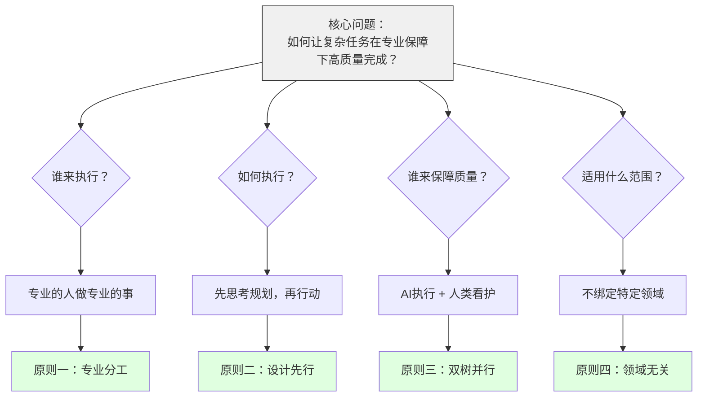

### 2.2 四大原则详解

#### 原则一：专业分工

| 维度 | 说明 |
|------|------|
| **问题来源** | 复杂任务涉及多个专业领域，一人无法精通全部 |
| **解决思路** | 专业的事交给专业的 AI/人去做 |
| **价值主张** | 专业保障、效率提升 |
| **实现方式** | 专家节点注册 + 任务匹配 |

**为什么专业分工是第一原则？**

```
复杂任务 = 多领域知识 × 多环节协作
        ↓
一人全包 = 专业度不足 + 质量风险
        ↓
专业分工 = 每个环节由最专业的人/AI负责
        ↓
质量保障
```

#### 原则二：设计先行

| 维度 | 说明 |
|------|------|
| **问题来源** | 匆忙执行容易走偏，返工成本高 |
| **解决思路** | 谋定而后动，思考规划先于行动 |
| **价值主张** | 方向正确、避免返工 |
| **实现方式** | 设计阶段 → 审视 → 实施阶段 |

**为什么设计先行是必要约束？**

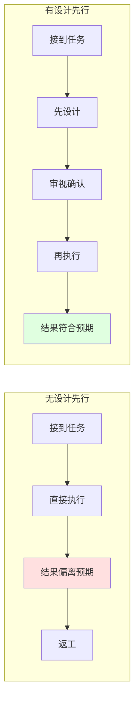

#### 原则三：双树并行

| 维度 | 说明 |
|------|------|
| **问题来源** | AI 执行效率高但可能偏离预期，需人类把关 |
| **解决思路** | AI 执行树 + 人类看护树，节点一一对应 |
| **价值主张** | 效率与质量兼顾 |
| **实现方式** | 每个执行节点对应一个看护节点 |

**为什么是双树而非单树？**

```
单树（只有AI执行）    → 效率高但质量不可控
单树（只有人类执行）  → 质量可控但效率低
双树并行              → AI做 + 人看 = 效率 × 质量
```

#### 原则四：领域无关

| 维度 | 说明 |
|------|------|
| **问题来源** | 不同领域有相似的专业分工需求，但现有工具绑定特定领域 |
| **解决思路** | 是方法论而非具体解决方案，不绑定特定领域 |
| **价值主张** | 一套方法论适配多个领域，学习成本低 |
| **实现方式** | 元模型抽象 + 领域特化配置 |

**为什么必须是方法论而非解决方案？**

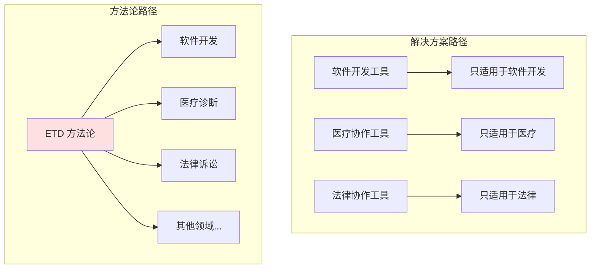

### 2.3 原则到目标的推导

四大原则确定后，自然推导出三大目标：

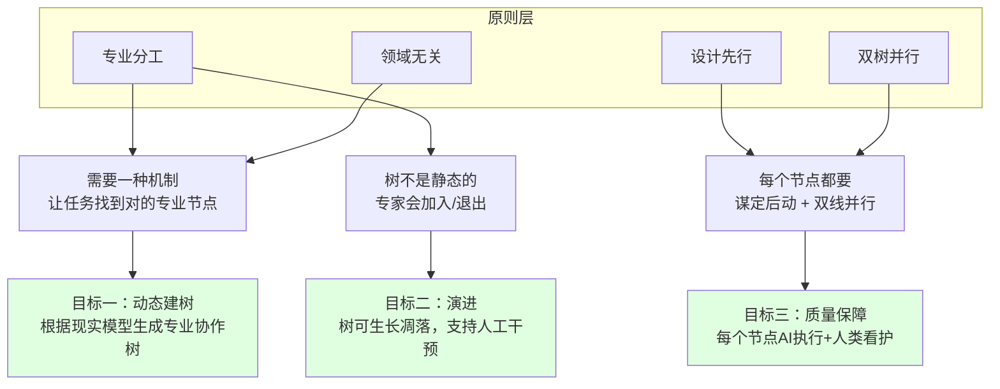

### 2.4 三大目标详解

#### 目标一：动态建树

| 维度 | 说明 |
|------|------|
| **推导来源** | 专业分工 + 领域无关 → 不同领域/团队需要不同的专家树 |
| **核心问题** | 树从哪里来？如何适配不同场景？ |
| **解决方案** | 根据现实模型（领域、团队、项目）动态生成 |
| **关键机制** | 现实模型解析 → 专家发现 → 树结构生成 |

**动态建树的逻辑链：**

```
不同领域 → 专家类型不同
不同团队 → 专家配置不同
不同项目 → 任务结构不同
        ↓
无法预设固定树
        ↓
必须动态生成
        ↓
目标：动态建树
```

#### 目标二：演进

| 维度 | 说明 |
|------|------|
| **推导来源** | 专业分工 → 专家会动态变化（加入/退出/能力变化） |
| **核心问题** | 树如何应对现实变化？ |
| **解决方案** | 树是活的，支持生长、凋落、人工干预 |
| **关键机制** | 专家注册/注销 → 树结构调整 → 人工确认（非必须） |

**演进的三种形态：**

| 形态 | 触发条件 | 处理方式 |
|------|---------|---------|
| **生长** | 新专家注册、新任务产生 | 动态添加节点 |
| **凋落** | 专家退出、任务完成 | 节点淡出或移除 |
| **人工干预** | AI 需要决策或人工主动调整 | 允许人工输入 |

#### 目标三：质量保障

| 维度 | 说明 |
|------|------|
| **推导来源** | 设计先行 + 双树并行 → 每个节点都有质量保障机制 |
| **核心问题** | 如何确保每个节点的输出质量？ |
| **解决方案** | 谋定后动 + AI执行 + 人类看护 |
| **关键机制** | 设计输出 → 人类审视 → 通过后实施 → 实施输出 → 人类审视 |

**质量保障的三重机制：**

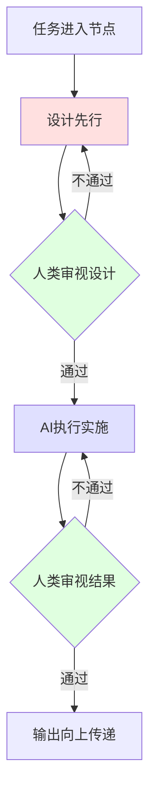

### 2.5 一句话目标

> **为任意领域的复杂任务，提供一套动态构建专业协作树的方法论，使每个任务在谋定后动的执行与看护中完成。**

### 2.6 核心定位

**ETD 是方法论，不是具体解决方案：**

| | 传统工具 | ETD |
|---|---------|-----|
| **定位** | 领域特定解决方案 | 领域无关方法论 |
| **树结构** | 固定预设 | 动态生成 |
| **适用范围** | 特定领域（如软件开发） | 任意领域 |
| **演进方式** | 静态配置 | 活的生长凋落 |

### 2.7 ETD 的生存方式：平台无关

> **核心观点**：ETD 是方法论，不是工具；通过 Adapter 接入中间工具能力，实现平台无关。

#### 为什么讨论这个问题

SDDU 作为 OpenCode 插件，存在平台锁定、维护分裂、用户受限等问题。ETD 要避免重蹈覆辙。

#### 三层架构的定位差异

| 层次 | 定位 | 解决的问题 |
|------|------|-----------|
| LLM | 能力引擎 | 智能从哪里来？ |
| 中间工具 | 执行框架 | 怎么执行、怎么协调？ |
| **ETD** | 业务方法论 | **怎么组织专业协作？** |

**结论**：ETD 不需要自己实现"工具"，只需通过 Adapter 接入工具能力。

> **决策**：ETD 采用平台无关架构，核心逻辑依赖抽象接口，通过可插拔 Adapter 接入具体平台（OpenCode/OpenClaw/自定义）。

---

## 3. 树的构建逻辑

### 3.1 为什么树不能预设

传统工具预设固定流程（如需求→设计→开发→测试），但现实中：

| 预设假设 | 现实情况 |
|---------|---------|
| 所有项目流程相同 | 不同领域流程差异巨大 |
| 专家类型固定 | 不同团队配置不同 |
| 树结构可枚举 | 树形态随现实变化 |

**结论**：树必须根据现实模型动态生成，而非预设。

### 3.2 构建的输入：现实模型

树的构建来源于三类现实信息：

| 输入 | 说明 | 示例 |
|------|------|------|
| **领域定义** | 该领域有哪些专业角色、任务如何分解 | 软件开发有产品/设计/开发/测试；医疗有诊断/检验/治疗 |
| **团队结构** | 当前团队有哪些人、各自的能力和角色 | 3人团队：1全栈+1产品+1设计 |
| **项目目标** | 项目要完成什么、质量要求如何 | 内部工具 vs 金融产品，审视密度不同 |

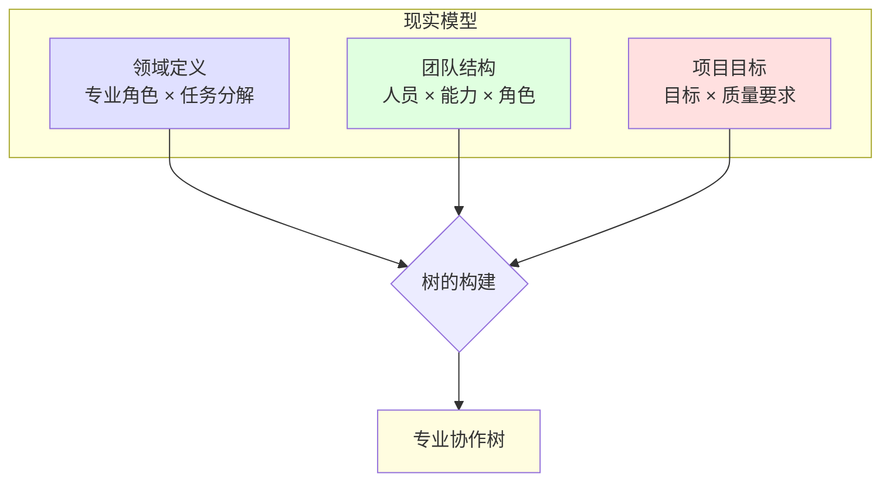

### 3.3 构建过程

树的构建是一个从现实模型到协作树的映射过程：

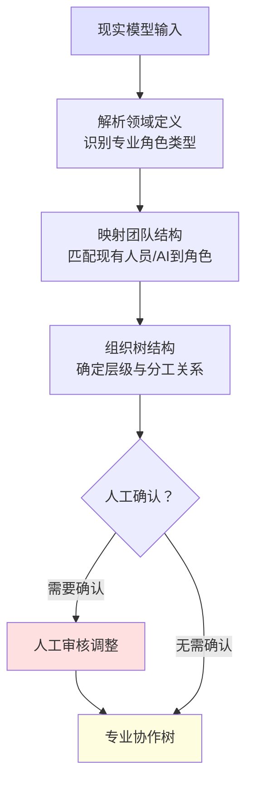

**构建的三个关键步骤**：

| 步骤 | 输入 | 处理 | 输出 |
|------|------|------|------|
| **领域解析** | 领域定义 | 识别该领域的专业角色类型、任务分解方式 | 领域角色模型 |
| **团队映射** | 团队结构 + 领域角色模型 | 将现有人员/AI映射到角色，发现缺失角色 | 专家节点列表 |
| **组织成型** | 项目目标 + 专家节点列表 | 确定层级关系、分工关系、审视关系 | 专业协作树 |

### 3.4 构建结果：专业协作树

构建完成的专业协作树包含两个维度：

| 维度 | 说明 |
|------|------|
| **结构维度** | 节点（专家角色）+ 边（分工/层级关系） |
| **流程维度** | 任务在节点间的流转路径 |

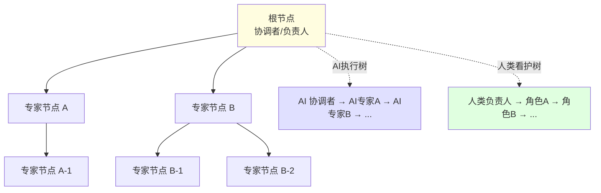

### 3.5 不同领域的构建差异

同一套构建逻辑，不同领域的输出完全不同：

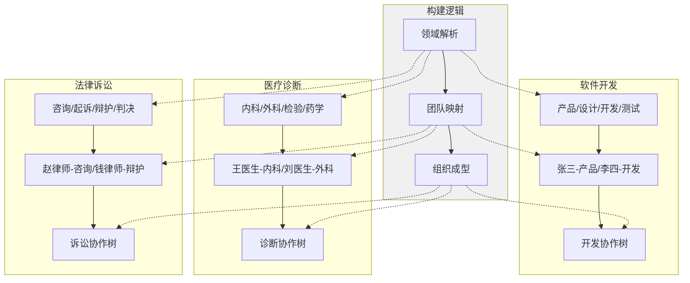

---

## 4. 树的演进逻辑

### 4.1 为什么树需要演进

树构建完成后不是静态的，现实世界持续变化：

| 现实变化 | 对树的影响 |
|---------|-----------|
| 新成员加入团队 | 需要生长新节点 |
| 成员离开团队 | 需要凋落旧节点 |
| 项目阶段变化 | 需要调整重点节点 |
| 领域认知深化 | 需要细化/合并节点 |
| AI 能力升级 | 需要更新专家能力声明 |

### 4.2 演进的三种形态

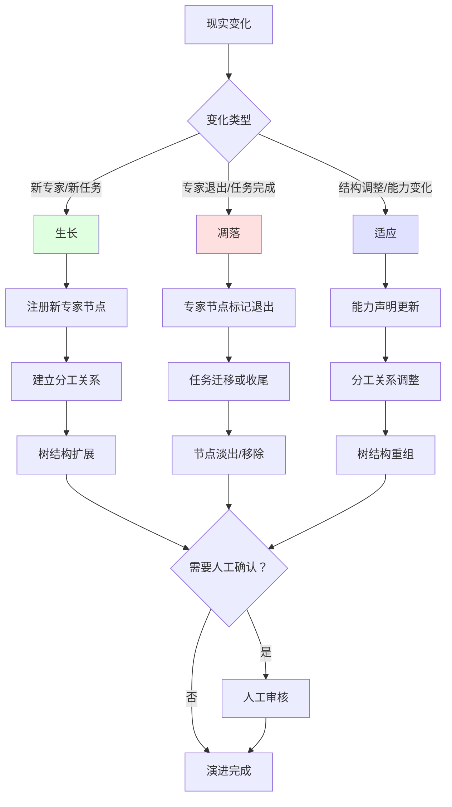

### 4.3 生长：新节点的加入

**触发条件**：新专家注册、新任务类型出现

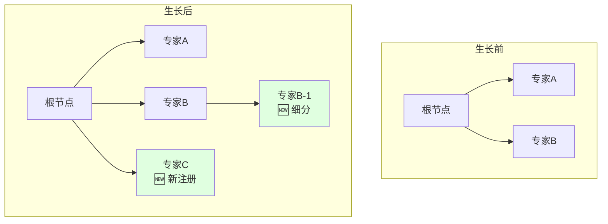

**生长规则**：

| 规则 | 说明 |
|------|------|
| 专家注册 → 节点生成 | 新注册的专家自动成为树的候选节点 |
| 能力匹配 → 位置确定 | 根据专家能力声明确定在树中的位置和层级 |
| 人工确认 → 正式生效 | 非必须，AI 可自动完成，必要时人工确认 |

### 4.4 凋落：旧节点的退出

**触发条件**：专家主动退出、长期不活跃、任务完成

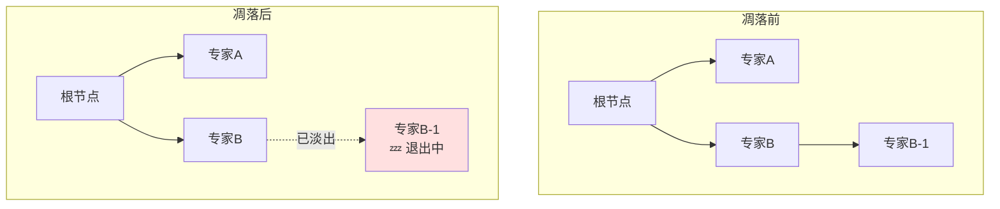

**凋落规则**：

| 规则 | 说明 |
|------|------|
| 主动退出 → 标记淡出 | 不是立即删除，先标记为"淡出中" |
| 任务收尾 → 逐步退出 | 等待当前任务完成后再正式移除 |
| 紧急退出 → 即时转移 | 立即将任务转移给其他专家或上级节点 |

### 4.5 适应：结构的调整

**触发条件**：能力声明更新、分工关系变化、项目阶段切换

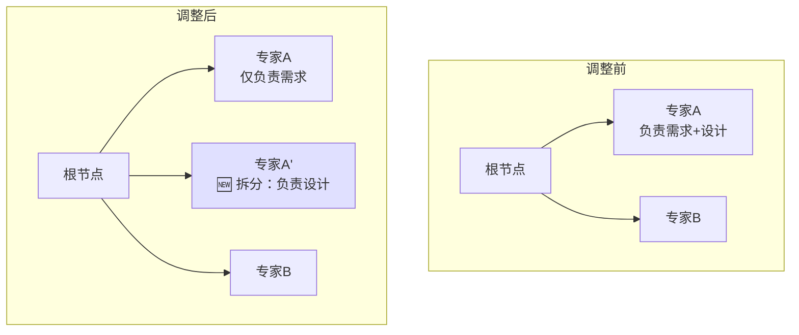

**适应规则**：

| 规则 | 说明 |
|------|------|
| 能力变更 → 节点调整 | 专家能力声明更新后，重新评估其在树中的位置 |
| 负载不均 → 任务重分配 | 当某节点负载过高时，考虑拆分或新增节点 |
| 阶段切换 → 重点转移 | 项目从设计阶段进入实施阶段，树的重点节点相应调整 |

### 4.6 人工干预的边界

演进过程中，人工干预遵循"非必须不干预"原则：

| 场景 | AI 自动处理 | 人工干预 |
|------|------------|---------|
| 新专家注册 → 确定位置 | ✅ 能力匹配自动定位 | ❌ 一般不需要 |
| 专家退出 → 任务转移 | ✅ 自动转移给同角色专家 | ✅ 无同角色时需人工指定 |
| 树结构调整 | ✅ 基于匹配度自动调整 | ✅ 关键结构调整需人工确认 |
| 新领域首次建树 | ❌ 无历史数据参考 | ✅ 必须人工参与 |

---

## 5. 树形递归分配模型

### 递归逻辑（含设计先行）

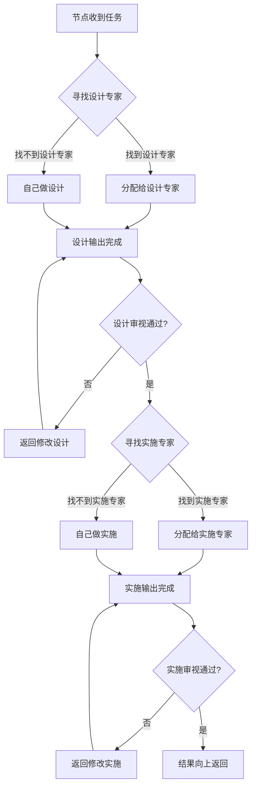

**设计先行约束：**

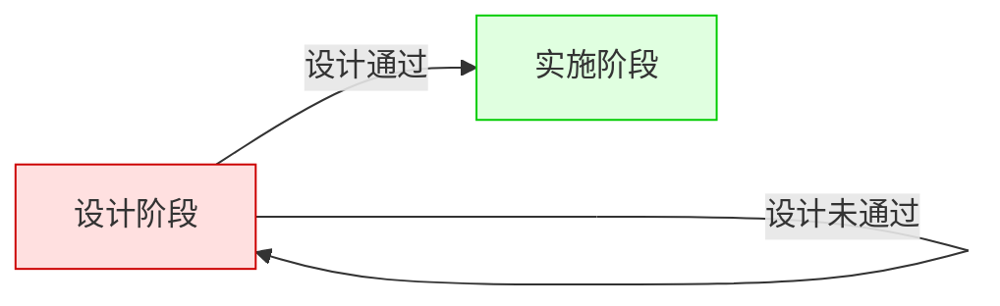

### 双树并行架构

| | AI 执行树 | 人类看护树 |
|---|----------|-----------|
| **职责** | 执行任务 | 审视结果 |
| **原则** | 专业事交给专业 AI | 专业事交给专业人 |
| **根节点** | AI 协调者 | 人类负责人 |
| **专家节点** | 各领域专业 AI Agent | 各领域专业人类角色 |

**设计先行 × 双树并行：**

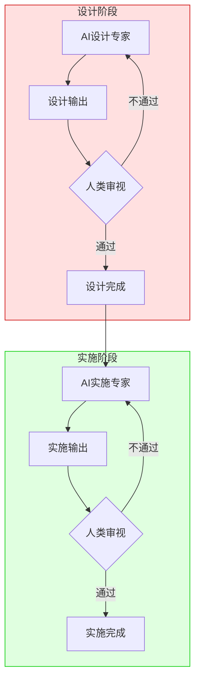

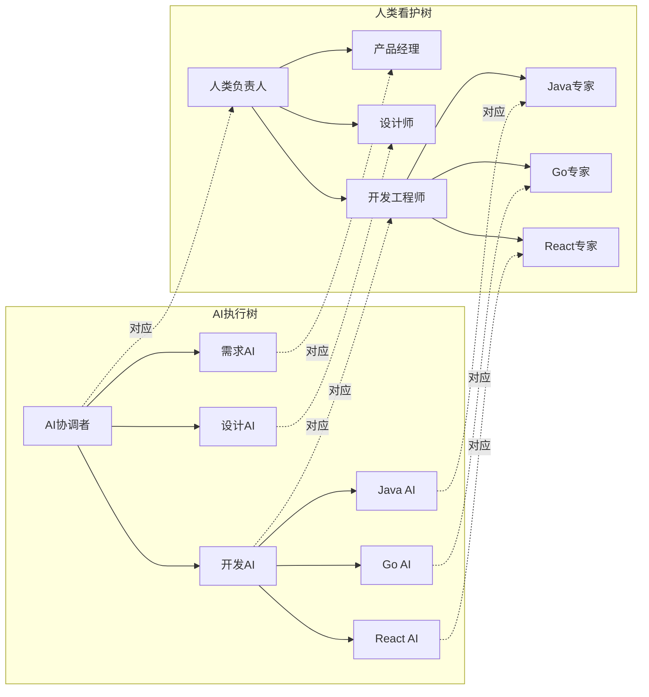

**注**：每个 AI 专家节点内部也遵循设计先行原则，设计 AI 产出设计方案，实施 AI 产出实施结果，人类对应角色分别审视。

**注**：上图以软件开发领域为例，展示双树并行的结构。树的形态由现实世界动态生成，不绑定特定领域。

---

## 6. 示例：软件开发领域的专家树

> 本节以软件开发领域为例，展示 ETD 方法论在特定领域的具体形态。**这不是 ETD 的固定结构，而是领域特化的一个示例。**

### 生命周期定义

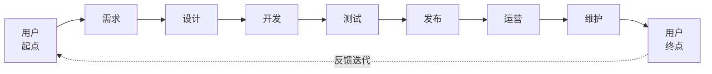

### 专家节点树形结构

```mermaid
flowchart TD
    ROOT[根节点<br>AI协调者 / 人类负责人] --> REQ[需求专家]
    ROOT --> DES[设计专家]
    ROOT --> DEV[开发专家]
    ROOT --> TEST[测试专家]
    ROOT --> PUB[发布专家]
    ROOT --> OPS[运营专家]
    ROOT --> MNT[维护专家]
    
    REQ --> REQ1[用户研究专家]
    REQ --> REQ2[竞品分析专家]
    REQ --> REQ3[需求文档专家]
    
    DES --> DES1[产品设计专家]
    DES --> DES2[交互设计专家]
    DES --> DES3[视觉设计专家]
    DES --> DES4[架构设计专家]
    DES4 --> DES4A[前端架构专家]
    DES4 --> DES4B[后端架构专家]
    DES4 --> DES4C[数据架构专家]
    
    DEV --> DEV1[前端开发专家]
    DEV --> DEV2[后端开发专家]
    DEV --> DEV3[移动端开发专家]
    DEV --> DEV4[数据库开发专家]
    
    DEV1 --> DEV1A[React专家]
    DEV1 --> DEV1B[Vue专家]
    DEV1 --> DEV1C[小程序专家]
    
    DEV2 --> DEV2A[Java专家]
    DEV2 --> DEV2B[Go专家]
    DEV2 --> DEV2C[Python专家]
    DEV2 --> DEV2D[Node.js专家]
    
    DEV3 --> DEV3A[iOS专家]
    DEV3 --> DEV3B[Android专家]
    
    DEV4 --> DEV4A[MySQL专家]
    DEV4 --> DEV4B[PostgreSQL专家]
    DEV4 --> DEV4C[MongoDB专家]
    
    TEST --> TEST1[功能测试专家]
    TEST --> TEST2[性能测试专家]
    TEST --> TEST3[安全测试专家]
    TEST --> TEST4[自动化测试专家]
    
    PUB --> PUB1[部署专家]
    PUB --> PUB2[监控专家]
    PUB1 --> PUB1A[Docker专家]
    PUB1 --> PUB1B[K8s专家]
    PUB1 --> PUB1C[云平台专家]
    
    OPS --> OPS1[数据分析专家]
    OPS --> OPS2[用户增长专家]
    
    MNT --> MNT1[Bug修复专家]
    MNT --> MNT2[技术债专家]
```

### 生命周期 × AI输出 × 人类审视

| 生命周期 | AI 设计输出 | 人类审视角色 | AI 实施输出 | 人类审视角色 |
|---------|-----------|-------------|-----------|-------------|
| **需求** | 需求文档、用户故事、优先级 | 产品经理 | 用户调研报告、竞品分析 | 用户研究员 |
| **设计** | 产品设计稿、交互稿、架构方案 | 产品设计师、UX设计师、架构师 | 视觉稿、数据模型、原型 | UI设计师、数据库设计师 |
| **开发** | 技术方案、代码架构 | 技术负责人 | 代码、接口实现、数据库脚本 | 前端工程师、后端工程师 |
| **测试** | 测试用例、测试方案 | 测试负责人 | 测试报告、缺陷报告 | 测试工程师 |
| **发布** | 发布方案、回滚预案 | 发布负责人 | 部署结果、监控配置 | 运维工程师、SRE |
| **运营** | 运营策略、增长方案 | 运营负责人 | 数据分析报告、用户反馈报告 | 数据分析师 |
| **维护** | 维护计划、优先级排序 | 技术负责人 | Bug修复代码、技术债处理结果 | 开发工程师 |

---

## 7. Solo vs Team 的本质

### 对比

| | Solo | Team |
|---|------|------|
| **定义** | 根节点找不到下级专家 → 自己做/看全流程 | 根节点找到下级专家 → 分配给专家 |
| **差异** | 专家节点为空 | 专家节点存在 |
| **过渡** | 不是模式切换，而是引入专家节点 |

```mermaid
flowchart TD
    subgraph Solo[Solo模式 - 专家节点为空]
        S1[根节点] --> S2{找专家}
        S2 -->|找不到| S3[自己做]
        S3 --> S4[需求]
        S4 --> S5{找专家}
        S5 -->|找不到| S6[自己做]
        S6 --> S7[设计]
        S7 --> S8[...继续自己做]
    end
    
    subgraph Team[Team模式 - 专家节点存在]
        T1[根节点] --> T2{找专家}
        T2 -->|找到产品经理| T3[分配需求]
        T3 --> T4[产品经理审视]
        T1 --> T5{找专家}
        T5 -->|找到设计师| T6[分配设计]
        T6 --> T7[设计师审视]
        T1 --> T8{找专家}
        T8 -->|找到开发者| T9[分配开发]
        T9 --> T10[开发者审视]
    end
```

**一句话定义：**

> Solo = 专家节点为空时的特例  
> Team = 专家节点存在时的常态

---

## 8. 领域适配示例

ETD 作为方法论，可适配多种领域：

| 领域 | 专家类型示例 | 任务类型示例 |
|------|-------------|-------------|
| **软件开发** | 产品经理、设计师、开发工程师、测试工程师... | 需求分析、架构设计、编码实现、测试验证... |
| **医疗诊断** | 医生、护士、技师、药师... | 问诊、检查、诊断、治疗... |
| **法律诉讼** | 律师、法官、书记员、专家证人... | 咨询、起诉、辩护、判决... |
| **教育培训** | 教师、辅导员、教研员... | 备课、授课、辅导、评估... |

**领域适配要点**：

1. **定义领域专家类型**：分析该领域需要的专业角色
2. **定义任务分解方式**：确定任务在该领域的拆分粒度
3. **建立匹配规则**：定义任务与专家的匹配逻辑
4. **设定审视流程**：确定人类看护树的审视节点

---

## 10. 用户价值

| 角色 | 价值 |
|------|------|
| **Solo 执行者** | 一人搞定全流程，未来可平滑引入专家节点 |
| **团队负责人** | 任务分配给对应专家，无需人工协调 |
| **专业角色** | 只看护自己专业领域的 AI 输出 |
| **跨领域用户** | 同一套方法论适配不同领域，学习成本低 |

---

## 11. 风险与限制

| 风险 | 等级 | 缓解措施 |
|------|------|---------|
| 专家节点匹配精度不足 | 🔴 高 | 建立专家能力声明体系，支持人工干预 |
| 树形结构层级过深 | 🟡 中 | 限制最大层级（如 ≤5），提供扁平化视图 |
| AI 执行树与人类看护树同步 | 🟡 中 | 节点一一对应，状态实时同步 |
| 领域适配成本 | 🟡 中 | 提供领域模板，降低适配门槛 |
| 元模型抽象过度 | 🟡 中 | 保持元模型精简，避免过度设计 |
| 专家节点动态变更 | 🟡 中 | 支持热注册/注销，缓存失效机制 |

---

## 13. 问题澄清记录

### 问题 1/5：现实模型来源 ✅ 已解决

**决策**：人工输入 + 模板推荐（无系统感知）

**核心要点**：
- 人工输入：用户通过配置文件/CLI/Web 描述领域、项目、团队信息
- 模板推荐：系统根据输入推荐匹配的预设模板
- 无系统感知：不主动读取 Git、Slack、邮件等外部系统数据

---

### 问题 2/5：树的生成时机 ✅ 已解决

**决策**：首次构建 80%-90% + 持续演进

**核心要点**：
- 首次构建 80%-90%：项目启动时快速生成核心主干结构
- 持续演进：运行过程中根据现实变化动态生长、凋落、调整
- 演进触发：人工主动触发 + 系统自动检测关键变化

---

### 问题 3/5：元模型抽象 ✅ 已解决

**决策**：保持五元模型（简单优先）

**核心要点**：
- 五元模型足够：专家、任务、匹配、组织、演进
- 状态内嵌管理：任务/专家的状态作为属性管理
- 流程即分配：任务流转由"匹配+组织"协作完成

---

### 问题 4/5：模板机制 ✅ 已解决

**决策**：要素模板系统（零输入即可生成完整工作流）

**核心原则**：任何需要人类输出信息构建的要素系统都应该提供模板

**模板类型**：
- **领域模板**：根据领域类型推荐任务分解模板（如软件开发→需求/设计/开发/测试）
- **专家模板**：按人类角色生成对应的 AI 专家节点（如人类"产品经理"→AI"需求专家"）
- **任务模板**：任务的输入/输出/约束条件模板
- **审视模板**：人类看护节点的审视要点和标准模板

**零输入启动**：最简单情况下，人类不提供任何输入，系统基于默认模板生成完整工作流（包含所有要素）

**动态调整**：模板为起点，根据人类输入的现实模型动态调整，贴合实际为目标

---

### 问题 5/5：演进中人工干预的边界 ✅ 已解决

**决策**：可配置策略（规则自定义）

**核心要点**：
- Sensible Defaults：提供开箱即用的合理默认规则
- 多级配置继承：系统默认 → 组织级 → 用户级 → 项目级
- 四级干预级别：自动执行、通知确认、阻塞确认、紧急升级

---

### 决策汇总

| # | 问题 | 决策 |
|---|------|------|
| 1 | 现实模型来源 | 人工输入 + 模板推荐 |
| 2 | 树的生成时机 | 首次构建 80-90% + 持续演进 |
| 3 | 元模型抽象 | 保持五元模型 |
| 4 | 模板机制 | 要素模板系统（零输入即可生成完整工作流） |
| 5 | 演进中人工干预边界 | 可配置策略 |

---

## 14. 下一步建议

### 推荐流程

1. ✅ 需求挖掘完成（当前阶段）
2. ✅ 创建 ETD 独立代码仓库
3. ✅ 迁移 discovery 文档至新仓库
4. 👉 为 ETD 编写产品规范（spec）
5. 👉 制定技术规划和任务分解

### 规范编写重点关注

- 元模型设计（专家、任务、匹配、组织、演进的抽象规则）
- 动态建树机制设计
- 递归分配算法设计
- AI 执行树与人类看护树的同步机制
- 演进机制（生长、凋落、人工干预）设计
- 领域适配方案

---

## 15. 产品命名说明

**ETD = Expert Tree Design**

| 字母 | 含义 | 核心特点 |
|------|------|---------|
| **E**xpert | 专家分工 | 专业的事交给专业的 AI/人去做 |
| **T**ree | 动态协作树 | 根据现实模型动态生成，可生长凋落 |
| **D**esign | 设计先行 | 谋定而后动，思考规划先于行动 |

**产品副标题**: AI执行 × 人类看护

**产品定位**: ETD 是一套领域无关的方法论，为任意领域的复杂任务提供动态构建专业协作树的机制，实现专家分工看护和谋定后动约束。

---

**需求挖掘完成时间**: 2026-04-18  
**需求挖掘更新时间**: 2026-04-18  
**需求挖掘状态**: discovered ✅ (全部待澄清问题已解决)  
**版本**: v2.1.0  
**下一步**: 为 ETD 编写产品规范（spec）