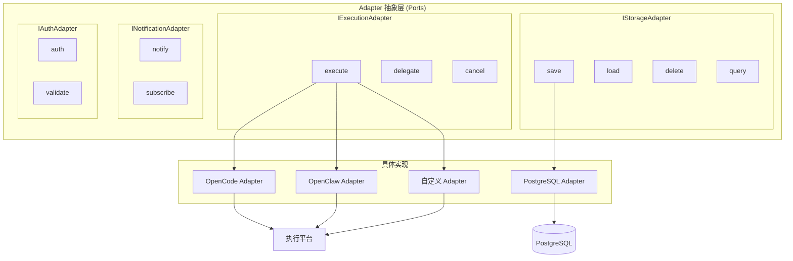
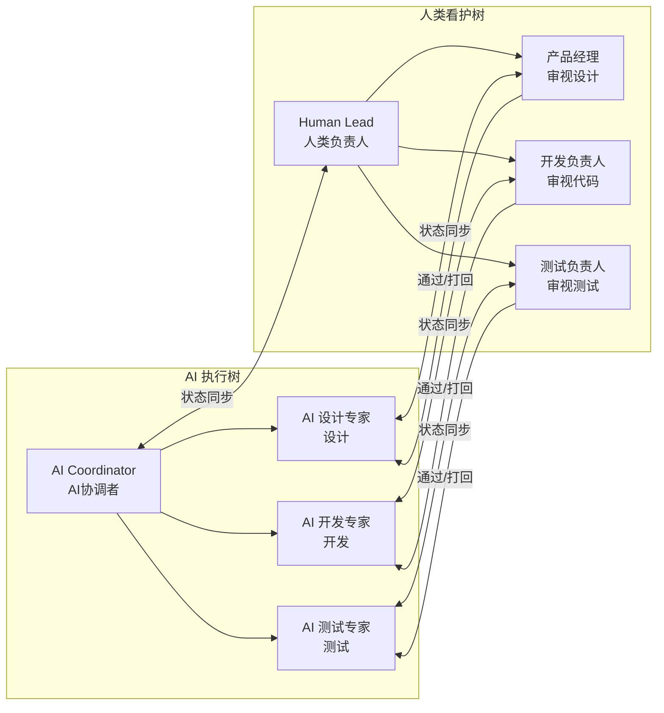
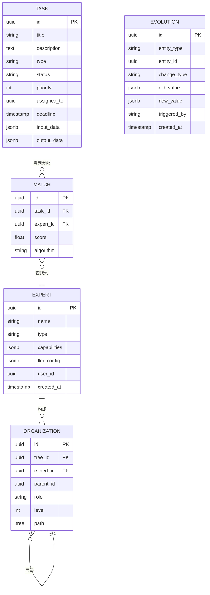
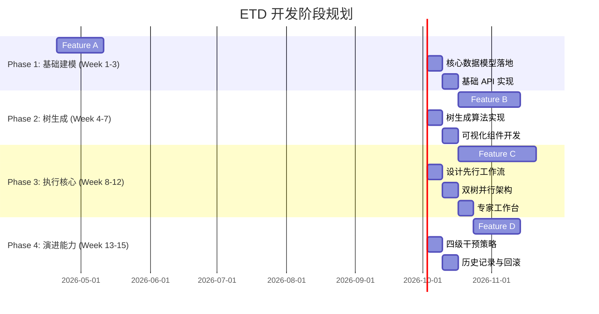
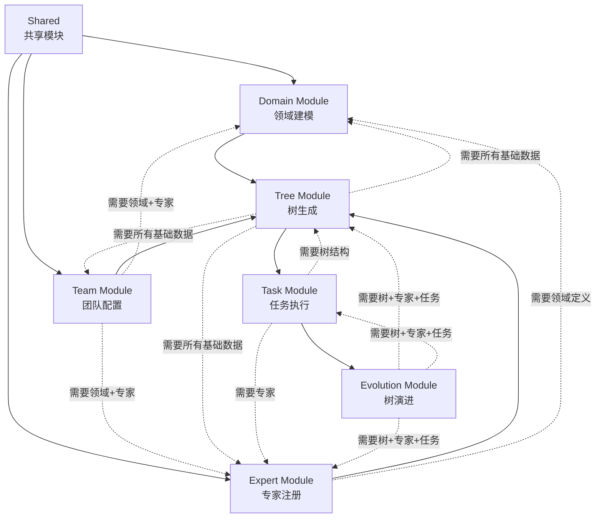

# ETD (Expert Tree Design) 技术规划

**Feature ID**: ETD-001  
**版本**: 1.1.0-plan  
**状态**: planned  
**创建日期**: 2026-04-18  
**最后更新**: 2026-04-18  

---

## 目录

1. [架构概述](#1-架构概述)
2. [技术栈选择](#2-技术栈选择)
3. [模块设计](#3-模块设计)
4. [数据模型设计](#4-数据模型设计)
5. [API 设计](#5-api-设计)
6. [算法设计](#6-算法设计)
7. [实现计划](#7-实现计划)
8. [依赖分析](#8-依赖分析)
9. [风险评估](#9-风险评估)
10. [ADR 记录](#10-adr-记录)

---

## 1. 架构概述

### 1.1 分层架构

系统采用六层分层架构设计：

| 层级 | 组件 | 职责 |
|------|------|------|
| 用户层 | CLI / Web UI / Mobile | 多终端接入 |
| API 层 | REST / WebSocket / GraphQL | 协议转换、认证鉴权 |
| 应用服务层 | 4 Features + Shared Services | 核心业务逻辑 |
| 领域层 | 五元模型 + 领域逻辑 | 核心业务规则 |
| 基础设施层 | DB / Cache / MQ / Storage | 数据持久化 |
| 外部集成层 | LLM / Auth / Notification | 第三方服务 |
| **平台适配层** | **Adapter 抽象层** | **平台无关架构** |

### 1.1.1 平台无关架构设计

> **核心决策**：ETD 是方法论，不是工具；通过 Adapter 接入中间工具能力，实现平台无关。

#### 三层架构定位

| 层次 | 定位 | 解决的问题 | ETD 职责 |
|------|------|-----------|---------|
| LLM | 能力引擎 | 智能从哪里来？ | 通过 Adapter 调用 |
| 中间工具 | 执行框架 | 怎么执行、怎么协调？ | 通过 Adapter 接入 |
| **ETD** | 业务方法论 | **怎么组织专业协作？** | **核心逻辑所在** |

#### Adapter 抽象层设计



#### 平台支持策略

| 平台 | 支持状态 | 实现优先级 | 说明 |
|------|---------|-----------|------|
| **OpenCode** | 优先支持 | P0 | AI Agent 运行环境，首批适配 |
| **OpenClaw** | 计划支持 | P1 | Claude Code CLI，第二批适配 |
| **自定义** | 完全支持 | P2 | 用户可自行实现 Adapter |
| **本地 LLM** | 可选支持 | P2 | 本地模型备用方案 |

### 1.2 核心模块关系

基于 spec 的 4 个垂直 Feature 划分：

```mermaid
graph LR
    subgraph "Feature A: 领域建模"
        A1[Domain Service<br/>领域定义管理]
        A2[Expert Service<br/>专家注册中心]
        A3[Team Service<br/>团队结构配置]
    end
    
    subgraph "Feature B: 树生成"
        B1[Tree Service<br/>动态树生成]
        B2[Match Service<br/>专家匹配算法]
        B3[Visual Service<br/>树可视化]
    end
    
    subgraph "Feature C: 任务执行"
        C1[Task Service<br/>任务生命周期]
        C2[Dispatch Service<br/>任务调度]
        C3[Review Service<br/>人类审视]
    end
    
    subgraph "Feature D: 树演进"
        D1[Evolution Service<br/>演进引擎]
        D2[Policy Service<br/>策略配置]
        D3[History Service<br/>历史记录]
    end
    
    A1 --> A2
    A2 --> A3
    A3 --> B1
    B1 --> B2
    B2 --> B3
    B3 --> C1
    C1 --> C2
    C2 --> C3
    C3 --> D1
    D1 --> D2
    D2 --> D3
```



### 1.3 双树并行架构



---

## 2. 技术栈选择

### 2.1 技术栈总览

| 层级 | 技术 | 版本 | 选型理由 |
|------|------|------|----------|
| **后端语言** | TypeScript | 5.x | 类型安全，生态丰富 |
| **运行时** | Node.js | 20 LTS | 长期支持版本 |
| **Web 框架** | NestJS | 10.x | 企业级，依赖注入 |
| **ORM** | Prisma | 5.x | 类型安全，迁移友好 |
| **数据库** | PostgreSQL | 16 | JSONB 支持，扩展性好 |
| **缓存** | Redis | 7.x | 数据结构丰富 |
| **消息队列** | RabbitMQ | 3.12 | 复杂路由，延迟队列 |
| **前端框架** | React | 18 | 生态成熟 |
| **UI 库** | Ant Design | 5.x | 企业级组件 |
| **构建工具** | Vite | 5.x | 快速开发 |
| **容器化** | Docker | 24.x | 生态成熟 |
| **编排** | Kubernetes | 1.28 | 企业级 |

### 2.2 选型对比

#### 后端框架对比

| 框架 | 优点 | 缺点 | 适用性 |
|------|------|------|--------|
| **NestJS** | 企业级架构、依赖注入、TypeScript 友好 | 学习曲线较陡 | ✅ 推荐 |
| Express | 简单轻量、生态丰富 | 缺乏架构约束 | 小型项目 |
| Fastify | 高性能、低开销 | 生态相对较小 | 性能优先 |

#### 数据库对比

| 数据库 | 优点 | 缺点 | 适用性 |
|--------|------|------|--------|
| **PostgreSQL** | JSONB 支持、扩展性好、ACID | 读写性能一般 | ✅ 推荐 |
| MySQL | 简单、性能好 | JSON 支持弱 | 传统应用 |
| MongoDB | 灵活、性能好 | 缺乏事务 | 非结构化数据 |
| Neo4j | 图查询优化 | 学习成本高 | 复杂关系网络 |

---

## 3. 模块设计

### 3.1 模块总览

基于 spec 的 4 个垂直 Feature，系统划分为 7 个核心模块：

| 模块 | 所属 Feature | 核心职责 |
|------|-------------|----------|
| **Domain Module** | A. 领域建模 | 领域定义管理、角色类型管理、模板管理 |
| **Expert Module** | A. 领域建模 | 专家注册中心、能力声明、专家匹配 |
| **Team Module** | A. 领域建模 | 团队结构配置、层级关系、专家分配 |
| **Tree Module** | B. 树生成 | 动态树生成算法、专家匹配算法、树可视化 |
| **Task Module** | C. 任务执行 | 任务生命周期管理、双树并行、人类审视流程 |
| **Evolution Module** | D. 树演进 | 演进引擎、四级干预策略、历史回滚 |

### 3.2 领域模块 (Domain Module)

```typescript
// 领域模块核心接口
interface DomainModule {
  // 领域定义管理 (FR-001)
  createDomain(input: CreateDomainInput): Promise<Domain>;
  updateDomain(id: string, input: UpdateDomainInput): Promise<Domain>;
  getDomain(id: string): Promise<Domain>;
  listDomains(query: DomainQuery): Promise<Domain[]>;
  
  // 角色类型管理 (FR-001)
  createRoleType(domainId: string, input: CreateRoleTypeInput): Promise<RoleType>;
  updateRoleType(id: string, input: UpdateRoleTypeInput): Promise<RoleType>;
  getRoleType(id: string): Promise<RoleType>;
  listRoleTypes(domainId: string): Promise<RoleType[]>;
  
  // 领域模板管理 (FR-010)
  createTemplate(input: CreateTemplateInput): Promise<Template>;
  getTemplate(id: string): Promise<Template>;
  listTemplates(query: TemplateQuery): Promise<Template[]>;
  matchTemplate(input: MatchInput): Promise<TemplateMatchResult>;
}
```

### 3.3 专家模块 (Expert Module)

```typescript
// 专家模块核心接口
interface ExpertModule {
  // 专家注册 (FR-002)
  registerExpert(input: RegisterExpertInput): Promise<Expert>;
  updateExpert(id: string, input: UpdateExpertInput): Promise<Expert>;
  getExpert(id: string): Promise<Expert>;
  listExperts(query: ExpertQuery): Promise<Expert[]>;
  unregisterExpert(id: string): Promise<void>;
  
  // 能力管理 (FR-002)
  declareCapability(expertId: string, input: CapabilityInput): Promise<Capability>;
  updateCapability(id: string, input: CapabilityInput): Promise<Capability>;
  listCapabilities(expertId: string): Promise<Capability[]>;
  
  // 专家匹配 (FR-005)
  matchExperts(task: Task, options: MatchOptions): Promise<ExpertMatchResult[]>;
  
  // 状态管理 (FR-002)
  enableExpert(id: string): Promise<void>;
  disableExpert(id: string): Promise<void>;
  updateAvailability(id: string, status: AvailabilityStatus): Promise<void>;
}
```

### 3.4 树模块 (Tree Module)

```typescript
// 树模块核心接口
interface TreeModule {
  // 树生成 (FR-004)
  generateTree(input: GenerateTreeInput): Promise<GeneratedTree>;
  validateTree(tree: Tree): ValidationResult;
  optimizeTree(tree: Tree): OptimizedTree;
  
  // 树管理
  createTree(input: CreateTreeInput): Promise<Tree>;
  updateTree(id: string, input: UpdateTreeInput): Promise<Tree>;
  getTree(id: string): Promise<Tree>;
  listTrees(query: TreeQuery): Promise<Tree[]>;
  deleteTree(id: string): Promise<void>;
  
  // 节点操作
  addNode(treeId: string, input: AddNodeInput): Promise<TreeNode>;
  updateNode(id: string, input: UpdateNodeInput): Promise<TreeNode>;
  removeNode(id: string): Promise<void>;
  moveNode(id: string, targetParentId: string): Promise<TreeNode>;
  
  // 匹配算法 (FR-005)
  findBestMatch(task: Task, candidates: Expert[]): ExpertMatch;
  calculateMatchScore(expert: Expert, task: Task): number;
  rankCandidates(candidates: Expert[], task: Task): RankedExpert[];
  
  // 可视化 (FR-004)
  generateVisualization(tree: Tree, format: VisualFormat): VisualData;
  exportTree(tree: Tree, format: ExportFormat): ExportData;
  importTree(data: ImportData): Tree;
}
```

### 3.5 任务模块 (Task Module)

```typescript
// 任务模块核心接口
interface TaskModule {
  // 任务管理 (FR-005)
  createTask(input: CreateTaskInput): Promise<Task>;
  updateTask(id: string, input: UpdateTaskInput): Promise<Task>;
  getTask(id: string): Promise<Task>;
  listTasks(query: TaskQuery): Promise<Task[]>;
  deleteTask(id: string): Promise<void>;
  
  // 任务状态
  transitionState(id: string, action: StateAction): Promise<Task>;
  getStateHistory(id: string): StateHistory[];
  
  // 任务分配 (FR-005)
  dispatchTask(taskId: string, options: DispatchOptions): Promise<DispatchResult>;
  reassignTask(taskId: string, newExpertId: string): Promise<Task>;
  returnTask(taskId: string, reason: string): Promise<Task>;
  escalateTask(taskId: string, level: EscalationLevel): Promise<Task>;
  
  // 设计先行工作流 (FR-006)
  startDesignPhase(taskId: string): Promise<DesignPhase>;
  submitDesign(taskId: string, design: DesignOutput): Promise<DesignReview>;
  reviewDesign(reviewId: string, decision: ReviewDecision): Promise<ReviewResult>;
  
  // 实施阶段 (FR-006)
  startImplementationPhase(taskId: string): Promise<ImplPhase>;
  submitImplementation(taskId: string, result: ImplOutput): Promise<ImplReview>;
  reviewImplementation(reviewId: string, decision: ReviewDecision): Promise<ReviewResult>;
  
  // 结果汇聚 (FR-005)
  aggregateResults(taskIds: string[]): AggregatedResult;
  propagateResult(childTaskId: string, parentTaskId: string): Promise<void>;
  
  // 双树同步 (FR-007)
  syncWithAITree(humanTaskId: string): Promise<SyncResult>;
  sendFeedback(aiTaskId: string, feedback: HumanFeedback): Promise<void>;
  
  // 专家工作台 (FR-009)
  getMyTasks(expertId: string, status?: TaskStatus): Promise<Task[]>;
  processTask(taskId: string, action: TaskAction): Promise<TaskResult>;
  delegateTask(taskId: string, targetExpertId: string): Promise<void>;
}
```

### 3.6 演进模块 (Evolution Module)

```typescript
// 演进模块核心接口
interface EvolutionModule {
  // 生长 (FR-008)
  growNode(input: GrowInput): Promise<GrowResult>;
  registerExpertAndGrow(expert: Expert): Promise<EvolutionResult>;
  
  // 凋落 (FR-008)
  witherNode(nodeId: string, options: WitherOptions): Promise<WitherResult>;
  unregisterExpertAndAdjust(expertId: string): Promise<EvolutionResult>;
  
  // 适应 (FR-008)
  adaptNode(nodeId: string, changes: AdaptationChanges): Promise<AdaptResult>;
  updateExpertAndRebalance(expertId: string, updates: ExpertUpdate): Promise<EvolutionResult>;
  
  // 策略配置 (FR-008)
  configurePolicy(input: PolicyInput): Promise<Policy>;
  getPolicy(id: string): Promise<Policy>;
  updatePolicy(id: string, input: PolicyInput): Promise<Policy>;
  deletePolicy(id: string): Promise<void>;
  
  // 四级干预 (FR-008)
  setInterventionLevel(context: InterventionContext, level: InterventionLevel): Promise<void>;
  executeAuto(context: ExecutionContext): Promise<AutoResult>;        // Level 0
  notifyAndConfirm(context: ExecutionContext): Promise<NotifyResult>; // Level 1
  blockAndConfirm(context: ExecutionContext): Promise<BlockResult>;   // Level 2
  escalateUrgently(context: ExecutionContext): Promise<EscalateResult>; // Level 3
  
  // 多级配置继承 (FR-008)
  setDefaultConfig(config: DefaultConfig): Promise<void>;
  setOrganizationConfig(orgId: string, config: OrgConfig): Promise<void>;
  setUserConfig(userId: string, config: UserConfig): Promise<void>;
  setProjectConfig(projectId: string, config: ProjectConfig): Promise<void>;
  getEffectiveConfig(context: ConfigContext): Promise<EffectiveConfig>;
  
  // 历史记录与回滚
  recordChange(change: ChangeRecord): Promise<void>;
  getHistory(entityType: string, entityId: string): ChangeRecord[];
  rollbackToVersion(entityType: string, entityId: string, version: string): Promise<RollbackResult>;
}
```

---

## 4. 数据模型设计

### 4.1 五元模型映射

基于 spec 的**五元模型**，设计对应的数据库表结构：



### 4.2 核心表结构

#### Expert (专家表)

```sql
CREATE TABLE experts (
  id UUID PRIMARY KEY DEFAULT gen_random_uuid(),
  name VARCHAR(255) NOT NULL,
  type VARCHAR(50) NOT NULL CHECK (type IN ('AI', 'HUMAN')),
  status VARCHAR(50) DEFAULT 'ACTIVE' CHECK (status IN ('ACTIVE', 'INACTIVE', 'SUSPENDED')),
  
  -- AI 专家特有配置
  llm_provider VARCHAR(50),  -- openai, claude, qwen, etc.
  llm_model VARCHAR(100),    -- gpt-4, claude-3-opus, etc.
  llm_config JSONB,          -- 温度、max_tokens 等
  
  -- 人类专家特有信息
  user_id UUID REFERENCES users(id),  -- 关联用户表
  contact_info JSONB,        -- 联系方式
  
  -- 能力声明 (能力向量)
  capabilities JSONB NOT NULL DEFAULT '[]', 
  -- 示例: [{"skill": "react", "level": 0.9}, {"skill": "ui_design", "level": 0.8}]
  
  -- 可用性配置
  availability JSONB DEFAULT '{"schedule": "weekdays", "timezone": "UTC+8"}',
  
  -- 元数据
  metadata JSONB DEFAULT '{}',
  created_at TIMESTAMPTZ DEFAULT NOW(),
  updated_at TIMESTAMPTZ DEFAULT NOW(),
  
  -- 索引
  CONSTRAINT idx_expert_type_status ON (type, status),
  CONSTRAINT idx_expert_capabilities ON capabilities USING GIN
);

-- GIN 索引用于 JSONB 查询
CREATE INDEX idx_experts_capabilities ON experts USING GIN(capabilities);
CREATE INDEX idx_experts_llm_config ON experts USING GIN(llm_config);
```

#### Task (任务表)

```sql
CREATE TABLE tasks (
  id UUID PRIMARY KEY DEFAULT gen_random_uuid(),
  title VARCHAR(500) NOT NULL,
  description TEXT,
  
  -- 任务分类
  type VARCHAR(100) NOT NULL,  -- requirement_analysis, architecture_design, coding, testing, etc.
  category VARCHAR(100),       -- 更细粒度的分类
  
  -- 优先级与紧急度
  priority INTEGER DEFAULT 3 CHECK (priority BETWEEN 1 AND 5),  -- 1=最高, 5=最低
  urgency VARCHAR(20) DEFAULT 'NORMAL' CHECK (urgency IN ('CRITICAL', 'HIGH', 'NORMAL', 'LOW')),
  
  -- 任务状态 (内嵌状态机)
  status VARCHAR(50) DEFAULT 'PENDING' CHECK (status IN (
    'PENDING',           -- 待分配
    'ASSIGNED',          -- 已分配
    'DESIGNING',         -- 设计阶段
    'DESIGN_REVIEW',     -- 设计审视
    'IMPLEMENTING',      -- 实施阶段
    'IMPL_REVIEW',       -- 实施审视
    'COMPLETED',         -- 已完成
    'CANCELLED',         -- 已取消
    'BLOCKED'            -- 被阻塞
  )),
  
  -- 分配信息
  assigned_to UUID REFERENCES experts(id),
  assigned_by UUID REFERENCES users(id),
  assigned_at TIMESTAMPTZ,
  
  -- 时间规划
  planned_start_at TIMESTAMPTZ,
  planned_end_at TIMESTAMPTZ,
  estimated_effort INTEGER,  -- 预估工时(小时)
  
  -- 实际执行
  actual_start_at TIMESTAMPTZ,
  actual_end_at TIMESTAMPTZ,
  actual_effort INTEGER,     -- 实际工时
  
  -- 任务输入/输出
  input_data JSONB,          -- 任务输入数据
  output_data JSONB,         -- 任务输出结果
  deliverables JSONB,        -- 交付物列表
  
  -- 约束条件
  constraints JSONB,         -- 约束条件 {deadline: '2024-12-31', budget: 1000}
  
  -- 依赖关系
  dependencies UUID[] REFERENCES tasks(id),  -- 依赖的其他任务
  blocks UUID[] REFERENCES tasks(id),        -- 阻塞的其他任务
  
  -- 父子任务
  parent_id UUID REFERENCES tasks(id),
  
  -- 项目/树关联
  project_id UUID REFERENCES projects(id),
  tree_id UUID REFERENCES trees(id),
  
  -- 审计信息
  created_by UUID REFERENCES users(id),
  updated_by UUID REFERENCES users(id),
  created_at TIMESTAMPTZ DEFAULT NOW(),
  updated_at TIMESTAMPTZ DEFAULT NOW(),
  
  -- 标签和元数据
  tags VARCHAR(50)[],
  metadata JSONB DEFAULT '{}'
);

-- 索引优化
CREATE INDEX idx_tasks_status ON tasks(status);
CREATE INDEX idx_tasks_assigned_to ON tasks(assigned_to);
CREATE INDEX idx_tasks_parent ON tasks(parent_id);
CREATE INDEX idx_tasks_project ON tasks(project_id);
CREATE INDEX idx_tasks_tree ON tasks(tree_id);
CREATE INDEX idx_tasks_priority_urgency ON tasks(priority, urgency);
CREATE INDEX idx_tasks_deadline ON tasks(planned_end_at);
CREATE INDEX idx_tasks_tags ON tasks USING GIN(tags);
CREATE INDEX idx_tasks_metadata ON tasks USING GIN(metadata);
```

### 4.3 其他核心表

#### Organization/Tree (组织/树结构表)

```sql
CREATE TABLE trees (
  id UUID PRIMARY KEY DEFAULT gen_random_uuid(),
  name VARCHAR(255) NOT NULL,
  description TEXT,
  domain_id UUID REFERENCES domains(id),
  team_id UUID REFERENCES teams(id),
  status VARCHAR(50) DEFAULT 'ACTIVE',
  root_node_id UUID,
  metadata JSONB DEFAULT '{}',
  created_at TIMESTAMPTZ DEFAULT NOW(),
  updated_at TIMESTAMPTZ DEFAULT NOW()
);

CREATE TABLE tree_nodes (
  id UUID PRIMARY KEY DEFAULT gen_random_uuid(),
  tree_id UUID REFERENCES trees(id) ON DELETE CASCADE,
  expert_id UUID REFERENCES experts(id),
  parent_id UUID REFERENCES tree_nodes(id),
  role VARCHAR(100),
  level INTEGER,
  path LTREE,  -- PostgreSQL ltree 扩展，用于高效树查询
  position INTEGER,
  status VARCHAR(50) DEFAULT 'ACTIVE',
  config JSONB DEFAULT '{}',
  metadata JSONB DEFAULT '{}',
  created_at TIMESTAMPTZ DEFAULT NOW(),
  updated_at TIMESTAMPTZ DEFAULT NOW()
);

-- ltree 索引用于高效树查询
CREATE INDEX idx_tree_nodes_path ON tree_nodes USING GIST(path);
CREATE INDEX idx_tree_nodes_tree ON tree_nodes(tree_id);
CREATE INDEX idx_tree_nodes_parent ON tree_nodes(parent_id);
CREATE INDEX idx_tree_nodes_expert ON tree_nodes(expert_id);
```

#### Evolution (演进记录表)

```sql
CREATE TABLE evolution_records (
  id UUID PRIMARY KEY DEFAULT gen_random_uuid(),
  entity_type VARCHAR(50) NOT NULL,  -- tree, node, expert
  entity_id UUID NOT NULL,
  change_type VARCHAR(50) NOT NULL,  -- grow, wither, adapt, move
  
  -- 变更前后值
  old_value JSONB,
  new_value JSONB,
  
  -- 变更上下文
  triggered_by VARCHAR(50),  -- manual, auto, system
  triggered_by_id UUID,      -- 触发者ID
  trigger_event VARCHAR(100), -- 触发事件
  
  -- 干预级别
  intervention_level INTEGER,  -- 0, 1, 2, 3
  
  -- 执行状态
  status VARCHAR(50) DEFAULT 'PENDING',  -- pending, executing, completed, failed, rolled_back
  executed_at TIMESTAMPTZ,
  completed_at TIMESTAMPTZ,
  
  -- 回滚信息
  rollback_to UUID REFERENCES evolution_records(id),
  rollback_reason TEXT,
  
  -- 审计
  created_at TIMESTAMPTZ DEFAULT NOW(),
  updated_at TIMESTAMPTZ DEFAULT NOW()
);

CREATE INDEX idx_evolution_entity ON evolution_records(entity_type, entity_id);
CREATE INDEX idx_evolution_change_type ON evolution_records(change_type);
CREATE INDEX idx_evolution_status ON evolution_records(status);
CREATE INDEX idx_evolution_created ON evolution_records(created_at);
```

---

## 5. API 设计

### 5.1 RESTful API 规范

#### API 端点概览

| 模块 | 基础路径 | 功能 |
|------|----------|------|
| Domain | `/api/v1/domains` | 领域管理 |
| Expert | `/api/v1/experts` | 专家管理 |
| Team | `/api/v1/teams` | 团队管理 |
| Tree | `/api/v1/trees` | 树管理 |
| Task | `/api/v1/tasks` | 任务管理 |
| Evolution | `/api/v1/evolution` | 演进管理 |

#### 标准响应格式

```typescript
// 成功响应
{
  "success": true,
  "data": { ... },
  "meta": {
    "timestamp": "2024-01-15T10:30:00Z",
    "requestId": "req-123456"
  }
}

// 列表响应
{
  "success": true,
  "data": [ ... ],
  "pagination": {
    "page": 1,
    "pageSize": 20,
    "total": 100,
    "totalPages": 5
  }
}

// 错误响应
{
  "success": false,
  "error": {
    "code": "VALIDATION_ERROR",
    "message": "Invalid input data",
    "details": [
      { "field": "name", "message": "Name is required" }
    ]
  }
}
```

### 5.2 核心 API 端点

#### Domain API

```yaml
# 领域管理
GET    /api/v1/domains              # 列表查询
POST   /api/v1/domains              # 创建领域
GET    /api/v1/domains/{id}         # 获取详情
PUT    /api/v1/domains/{id}         # 更新领域
DELETE /api/v1/domains/{id}         # 删除领域

# 角色类型管理
GET    /api/v1/domains/{id}/roles           # 获取领域角色列表
POST   /api/v1/domains/{id}/roles           # 创建角色类型
PUT    /api/v1/domains/{id}/roles/{roleId}  # 更新角色类型
DELETE /api/v1/domains/{id}/roles/{roleId}  # 删除角色类型

# 模板管理
GET    /api/v1/domains/templates            # 获取模板列表
POST   /api/v1/domains/{id}/templates      # 创建模板
POST   /api/v1/domains/templates/match     # 匹配最佳模板
```

#### Expert API

```yaml
# 专家管理
GET    /api/v1/experts              # 列表查询 (支持过滤)
POST   /api/v1/experts              # 注册专家
GET    /api/v1/experts/{id}         # 获取详情
PUT    /api/v1/experts/{id}         # 更新专家
DELETE /api/v1/experts/{id}         # 注销专家

# 能力管理
GET    /api/v1/experts/{id}/capabilities      # 获取能力列表
POST   /api/v1/experts/{id}/capabilities      # 声明能力
PUT    /api/v1/experts/{id}/capabilities/{capId}  # 更新能力
DELETE /api/v1/experts/{id}/capabilities/{capId}  # 删除能力

# 专家匹配
POST   /api/v1/experts/match        # 匹配最佳专家
POST   /api/v1/experts/rank         # 专家排名

# 状态管理
POST   /api/v1/experts/{id}/enable  # 启用专家
POST   /api/v1/experts/{id}/disable # 禁用专家
PUT    /api/v1/experts/{id}/availability  # 更新可用性
```

#### Tree API

```yaml
# 树管理
GET    /api/v1/trees                # 列表查询
POST   /api/v1/trees                # 创建树
GET    /api/v1/trees/{id}           # 获取详情
PUT    /api/v1/trees/{id}           # 更新树
DELETE /api/v1/trees/{id}           # 删除树

# 动态树生成 (FR-004)
POST   /api/v1/trees/generate       # 生成树
POST   /api/v1/trees/{id}/validate  # 验证树
POST   /api/v1/trees/{id}/optimize  # 优化树

# 节点操作
GET    /api/v1/trees/{id}/nodes               # 获取所有节点
POST   /api/v1/trees/{id}/nodes               # 添加节点
GET    /api/v1/trees/{id}/nodes/{nodeId}      # 获取节点详情
PUT    /api/v1/trees/{id}/nodes/{nodeId}      # 更新节点
DELETE /api/v1/trees/{id}/nodes/{nodeId}      # 删除节点
POST   /api/v1/trees/{id}/nodes/{nodeId}/move  # 移动节点

# 树可视化
GET    /api/v1/trees/{id}/visualization       # 获取可视化数据
GET    /api/v1/trees/{id}/export               # 导出树
POST   /api/v1/trees/import                    # 导入树
```

#### Task API

```yaml
# 任务管理
GET    /api/v1/tasks                # 列表查询
POST   /api/v1/tasks                # 创建任务
GET    /api/v1/tasks/{id}           # 获取详情
PUT    /api/v1/tasks/{id}           # 更新任务
DELETE /api/v1/tasks/{id}           # 删除任务

# 任务分配 (FR-005)
POST   /api/v1/tasks/{id}/dispatch  # 分配任务
POST   /api/v1/tasks/{id}/reassign  # 重新分配
POST   /api/v1/tasks/{id}/return    # 退回任务
POST   /api/v1/tasks/{id}/escalate  # 升级任务

# 状态流转
POST   /api/v1/tasks/{id}/transition # 状态转换
GET    /api/v1/tasks/{id}/history   # 状态历史

# 设计先行工作流 (FR-006)
POST   /api/v1/tasks/{id}/design/start      # 开始设计阶段
POST   /api/v1/tasks/{id}/design/submit     # 提交设计方案
POST   /api/v1/tasks/{id}/design/review     # 审视设计方案

# 实施阶段 (FR-006)
POST   /api/v1/tasks/{id}/implement/start   # 开始实施阶段
POST   /api/v1/tasks/{id}/implement/submit   # 提交实施结果
POST   /api/v1/tasks/{id}/implement/review   # 审视实施结果

# 结果汇聚 (FR-005)
POST   /api/v1/tasks/aggregate       # 汇聚结果
POST   /api/v1/tasks/{id}/propagate  # 向上传递结果

# 双树同步 (FR-007)
POST   /api/v1/tasks/{id}/sync       # 同步 AI 树状态
POST   /api/v1/tasks/{id}/feedback   # 发送人类反馈

# 专家工作台 (FR-009)
GET    /api/v1/workbench/tasks       # 获取我的任务
POST   /api/v1/workbench/tasks/{id}/process  # 处理任务
POST   /api/v1/workbench/tasks/{id}/delegate # 委托任务
```

#### Evolution API

```yaml
# 演进管理
GET    /api/v1/evolution/records             # 获取演进记录
GET    /api/v1/evolution/records/{id}        # 获取演进详情

# 生长 (FR-008)
POST   /api/v1/evolution/grow                # 生长节点
POST   /api/v1/evolution/experts/{id}/grow   # 注册专家并生长

# 凋落 (FR-008)
POST   /api/v1/evolution/wither              # 凋落节点
POST   /api/v1/evolution/experts/{id}/wither # 注销专家并调整

# 适应 (FR-008)
POST   /api/v1/evolution/adapt               # 适应节点
POST   /api/v1/evolution/experts/{id}/adapt  # 更新专家并再平衡

# 策略配置 (FR-008)
GET    /api/v1/evolution/policies            # 获取策略列表
POST   /api/v1/evolution/policies            # 创建策略
GET    /api/v1/evolution/policies/{id}       # 获取策略详情
PUT    /api/v1/evolution/policies/{id}       # 更新策略
DELETE /api/v1/evolution/policies/{id}       # 删除策略

# 四级干预 (FR-008)
POST   /api/v1/evolution/intervention/level  # 设置干预级别
POST   /api/v1/evolution/intervention/level-0-execute   # Level 0: 自动执行
POST   /api/v1/evolution/intervention/level-1-notify    # Level 1: 通知确认
POST   /api/v1/evolution/intervention/level-2-block     # Level 2: 阻塞确认
POST   /api/v1/evolution/intervention/level-3-escalate  # Level 3: 紧急升级

# 多级配置继承 (FR-008)
POST   /api/v1/evolution/config/default      # 设置默认配置
POST   /api/v1/evolution/config/organization/{orgId}  # 设置组织配置
POST   /api/v1/evolution/config/user/{userId}         # 设置用户配置
POST   /api/v1/evolution/config/project/{projectId}   # 设置项目配置
GET    /api/v1/evolution/config/effective             # 获取有效配置

# 历史记录与回滚
GET    /api/v1/evolution/history           # 获取变更历史
GET    /api/v1/evolution/history/{entityType}/{entityId}  # 获取实体历史
POST   /api/v1/evolution/rollback           # 回滚到指定版本
```

---

## 5. API 设计

### 5.1 RESTful API 规范

#### 标准响应格式

```typescript
// 成功响应
{
  "success": true,
  "data": { ... },
  "meta": {
    "timestamp": "2024-01-15T10:30:00Z",
    "requestId": "req-123456"
  }
}

// 列表响应
{
  "success": true,
  "data": [ ... ],
  "pagination": {
    "page": 1,
    "pageSize": 20,
    "total": 100,
    "totalPages": 5
  }
}

// 错误响应
{
  "success": false,
  "error": {
    "code": "VALIDATION_ERROR",
    "message": "Invalid input data",
    "details": [
      { "field": "name", "message": "Name is required" }
    ]
  }
}
```

### 5.2 核心 API 端点

详细 API 列表见 [4.3 各模块 API](#43-各模块-api) 章节。

---

## 6. 算法设计

### 6.1 专家匹配算法

```typescript
/**
 * 专家匹配算法
 * 基于能力向量相似度 + 多维度加权评分
 */
interface MatchAlgorithm {
  // 1. 能力相似度计算 (余弦相似度)
  calculateCapabilitySimilarity(
    taskRequirements: Capability[],
    expertCapabilities: Capability[]
  ): number;
  
  // 2. 历史表现评分
  calculatePerformanceScore(expertId: string): number;
  
  // 3. 可用性评分
  calculateAvailabilityScore(expert: Expert, task: Task): number;
  
  // 4. 负载均衡评分
  calculateWorkloadScore(expert: Expert): number;
  
  // 5. 综合评分
  calculateTotalScore(
    task: Task,
    expert: Expert,
    weights: MatchWeights
  ): MatchScore;
}

// 匹配权重配置
interface MatchWeights {
  capability: number;    // 能力匹配权重 (默认 0.4)
  performance: number;   // 历史表现权重 (默认 0.2)
  availability: number;  // 可用性权重 (默认 0.2)
  workload: number;      // 负载均衡权重 (默认 0.2)
}
```

### 6.2 树生成算法

```typescript
/**
 * 动态树生成算法
 * 基于领域定义 + 团队结构 + 项目目标生成最优树结构
 */
interface TreeGenerationAlgorithm {
  // 1. 解析领域定义，确定需要的角色类型
  analyzeDomainRequirements(domainId: string): RoleType[];
  
  // 2. 分析团队结构，映射可用专家
  mapTeamToExperts(teamId: string): ExpertMapping;
  
  // 3. 根据项目目标确定树层级
  determineTreeDepth(projectGoals: ProjectGoal[]): number;
  
  // 4. 生成初始树结构
  generateInitialTree(
    requirements: RoleType[],
    mappings: ExpertMapping,
    depth: number
  ): TreeStructure;
  
  // 5. 优化树结构
  optimizeTree(tree: TreeStructure): OptimizedTree;
  
  // 6. 验证树完整性
  validateTree(tree: TreeStructure): ValidationResult;
}
```

### 6.3 四级干预策略引擎

```typescript
/**
 * 四级干预策略引擎
 * 实现可配置的四级干预机制
 */
interface InterventionEngine {
  // 策略配置
  configurePolicy(policy: InterventionPolicy): void;
  
  // 评估上下文，确定干预级别
  evaluateContext(context: ExecutionContext): InterventionLevel;
  
  // Level 0: 自动执行
  executeAuto(context: ExecutionContext): Promise<AutoResult>;
  
  // Level 1: 通知确认
  notifyAndConfirm(context: ExecutionContext): Promise<NotifyResult>;
  confirmAfterNotification(recordId: string): Promise<void>;
  rollbackAfterNotification(recordId: string): Promise<void>;
  
  // Level 2: 阻塞确认
  blockAndConfirm(context: ExecutionContext): Promise<BlockResult>;
  confirmAndUnblock(recordId: string): Promise<void>;
  rejectAndUnblock(recordId: string, reason: string): Promise<void>;
  
  // Level 3: 紧急升级
  escalateUrgently(context: ExecutionContext): Promise<EscalateResult>;
  acknowledgeEscalation(recordId: string, userId: string): Promise<void>;
  resolveEscalation(recordId: string, resolution: string): Promise<void>;
}

// 干预策略配置
interface InterventionPolicy {
  defaultLevel: InterventionLevel;
  rules: InterventionRule[];
}

interface InterventionRule {
  name: string;
  condition: ConditionExpression;  // 条件表达式
  level: InterventionLevel;        // 匹配的干预级别
  priority: number;                  // 规则优先级
}
```

---

## 7. 实现计划

### 7.1 开发阶段规划

基于 spec 的 4 个垂直 Feature，按照依赖关系分 4 个阶段实现：



### 7.2 里程碑规划

| 里程碑 | 时间 | 交付物 | 验收标准 |
|--------|------|--------|----------|
| **M1: 基础就绪** | Week 3 | Domain/Expert/Team API | 完成基础 CRUD，通过单元测试 |
| **M2: 树生成** | Week 7 | Tree Generation API + UI | 能生成有效树结构，可视化展示 |
| **M3: MVP 核心** | Week 12 | Full Task Execution | 完成设计先行+双树并行+工作台 |
| **M4: 生产就绪** | Week 15 | Evolution + Full System | 四级干预+历史回滚，压力测试通过 |

### 7.3 文件影响分析

#### 新建文件清单

```
# 后端核心 (NestJS)
src/
├── modules/
│   ├── domain/                    # 领域建模模块
│   │   ├── domain.controller.ts
│   │   ├── domain.service.ts
│   │   ├── domain.module.ts
│   │   └── dto/
│   ├── expert/                    # 专家注册模块
│   │   ├── expert.controller.ts
│   │   ├── expert.service.ts
│   │   ├── expert.module.ts
│   │   └── dto/
│   ├── team/                      # 团队管理模块
│   │   ├── team.controller.ts
│   │   ├── team.service.ts
│   │   └── dto/
│   ├── tree/                      # 树生成模块
│   │   ├── tree.controller.ts
│   │   ├── tree.service.ts
│   │   ├── algorithms/
│   │   │   ├── tree-generator.ts
│   │   │   └── match-algorithm.ts
│   │   └── dto/
│   ├── task/                      # 任务执行模块
│   │   ├── task.controller.ts
│   │   ├── task.service.ts
│   │   ├── workflows/
│   │   │   ├── design-workflow.ts
│   │   │   └── implementation-workflow.ts
│   │   └── dto/
│   ├── evolution/                 # 树演进模块
│   │   ├── evolution.controller.ts
│   │   ├── evolution.service.ts
│   │   ├── intervention/
│   │   │   ├── intervention-engine.ts
│   │   │   └── level-handlers.ts
│   │   └── dto/
│   └── shared/                    # 共享模块
│       ├── llm/
│       ├── event-bus/
│       └── config/
├── entities/                      # 数据库实体
│   ├── expert.entity.ts
│   ├── task.entity.ts
│   ├── tree.entity.ts
│   └── ...
├── repositories/                  # 数据访问层
├── common/                        # 公共工具
└── main.ts

# 前端 (React)
web/
├── src/
│   ├── pages/
│   │   ├── domains/          # 领域管理页面
│   │   ├── experts/          # 专家管理页面
│   │   ├── teams/            # 团队管理页面
│   │   ├── trees/            # 树生成页面
│   │   ├── tasks/            # 任务管理页面
│   │   ├── workbench/        # 专家工作台
│   │   └── evolution/        # 演进管理页面
│   ├── components/
│   │   ├── tree-visualizer/  # 树可视化组件
│   │   ├── task-board/       # 任务看板
│   │   ├── expert-card/      # 专家卡片
│   │   └── design-review/    # 设计审视组件
│   ├── hooks/
│   ├── stores/               # 状态管理
│   ├── services/           # API 服务
│   └── utils/

# CLI 工具
cli/
├── src/
│   ├── commands/
│   │   ├── domain.ts       # 领域管理命令
│   │   ├── expert.ts       # 专家管理命令
│   │   ├── tree.ts         # 树生成命令
│   │   ├── task.ts         # 任务管理命令
│   │   └── workbench.ts    # 工作台命令
│   ├── services/
│   └── utils/

# 数据库迁移
prisma/
├── schema.prisma           # Prisma 数据模型
└── migrations/             # 迁移文件

# 配置与部署
config/
├── development.yaml
├── production.yaml
└── test.yaml

docker/
├── Dockerfile
├── docker-compose.yaml
└── kubernetes/
    ├── deployment.yaml
    ├── service.yaml
    └── ingress.yaml

# 文档
docs/
├── architecture/           # 架构文档
├── api/                    # API 文档
├── guides/                 # 开发指南
└── deployment/             # 部署文档
```

---

## 8. 依赖分析

### 8.1 模块依赖图



### 8.2 关键依赖关系

| 模块 | 依赖模块 | 依赖原因 |
|------|----------|----------|
| Domain | Shared | 基础工具、配置 |
| Expert | Shared, Domain | 需要领域定义来确定专家类型 |
| Team | Shared, Domain, Expert | 需要领域和专家来组建团队 |
| Tree | Shared, Domain, Expert, Team | 需要所有基础数据来生成树 |
| Task | Shared, Tree, Expert | 需要树结构和专家来分配任务 |
| Evolution | Shared, Tree, Expert, Task | 需要树、专家和任务数据来演进 |

---

## 9. 风险评估

### 9.1 技术风险

| 风险 | 可能性 | 影响 | 缓解措施 |
|------|--------|------|----------|
| **树生成算法性能瓶颈** | 中 | 高 | 1. 实现增量生成算法<br>2. 使用缓存预热<br>3. 支持异步生成 |
| **专家匹配算法不准确** | 中 | 高 | 1. 多维度评分机制<br>2. 人工反馈闭环<br>3. 持续优化模型 |
| **双树同步延迟** | 中 | 中 | 1. WebSocket 实时推送<br>2. 乐观锁机制<br>3. 冲突自动解决 |
| **四级干预策略复杂** | 高 | 中 | 1. 规则引擎解耦<br>2. 配置化规则<br>3. 单元测试覆盖 |

### 9.2 依赖风险

| 风险 | 可能性 | 影响 | 缓解措施 |
|------|--------|------|----------|
| **LLM Provider 不稳定** | 中 | 高 | 1. 多 Provider  failover<br>2. 本地模型备用<br>3. 降级策略 |
| **PostgreSQL 性能瓶颈** | 低 | 高 | 1. 读写分离<br>2. 分库分表<br>3. 缓存层 |
| **第三方认证服务故障** | 低 | 中 | 1. 本地认证降级<br>2. JWT 无状态认证 |

### 9.3 时间风险

| 风险 | 可能性 | 影响 | 缓解措施 |
|------|--------|------|----------|
| **MVP 延期** | 中 | 高 | 1. 功能优先级排序<br>2. 敏捷迭代交付<br>3. 范围可控裁剪 |
| **集成测试时间不足** | 中 | 高 | 1. 自动化测试覆盖<br>2. CI/CD 流水线<br>3. 并行测试 |

---

## 10. ADR 记录

### ADR-001: 采用垂直 Feature 拆分而非水平分层

**状态**: Accepted  
**日期**: 2026-04-18  

#### 背景
在 Discovery 阶段，ETD 被拆分为 3 个水平分层 Feature:
1. expert-node-registry (专家注册)
2. task-dispatcher (任务调度)
3. expert-workbench (专家工作台)

但在 Spec 阶段发现，这种拆分存在层间耦合严重、用户价值不直观的问题。

#### 决策
采纳 Spec 建议的 **4 个垂直 Feature 拆分**:
1. **Domain Modeling** (领域建模) - 定义"谁是专家"
2. **Tree Generation** (树生成) - 创建"协作结构"
3. **Task Execution** (任务执行) - 完成"实际工作"
4. **Tree Evolution** (树演进) - 适应"变化现实"

#### 后果
**正面**:
- 每个 Feature 都有独立的用户价值
- 可以独立交付和验证
- 团队可以并行开发
- 减少了层间耦合

**负面**:
- 需要跨层协调
- 可能需要更多集成测试

---

### ADR-002: 采用 PostgreSQL 作为主要数据库

**状态**: Accepted  
**日期**: 2026-04-18  

#### 背景
ETD 需要存储复杂的关系数据（树结构、专家关系）和半结构化数据（能力向量、配置）。需要选择合适的数据库。

#### 考虑选项
1. **PostgreSQL**: 关系型 + JSONB 支持
2. **MongoDB**: 文档型数据库
3. **Neo4j**: 图数据库
4. **MySQL**: 传统关系型

#### 决策
选择 **PostgreSQL** 作为主要数据库，理由：
1. **JSONB 支持**: 可以存储半结构化的能力向量、配置
2. **ltree 扩展**: 支持高效的树结构查询
3. **ACID 保证**: 数据一致性
4. **成熟稳定**: 生产环境验证
5. **扩展性好**: 支持分区、读写分离

#### 后果
**正面**:
- 灵活的数据模型
- 强大的查询能力
- 成熟运维工具

**负面**:
- 需要学习 JSONB 操作
- 水平扩展相对复杂

---

### ADR-003: 采用 NestJS 作为后端框架

**状态**: Accepted  
**日期**: 2026-04-18  

#### 背景
ETD 是一个企业级系统，需要良好的架构设计、依赖注入、模块化组织。需要选择合适的后端框架。

#### 考虑选项
1. **NestJS**: 企业级 Node.js 框架
2. **Express**: 轻量 Web 框架
3. **Fastify**: 高性能框架
4. **Spring Boot**: Java 生态

#### 决策
选择 **NestJS**，理由：
1. **企业级架构**: 内置依赖注入、模块化
2. **TypeScript 原生**: 类型安全
3. **生态丰富**: ORM、缓存、队列集成
4. **文档完善**: 易于团队上手
5. **微服务支持**: 便于后续扩展

#### 后果
**正面**:
- 代码组织清晰
- 易于测试
- 团队协作顺畅

**负面**:
- 学习曲线较陡
- 样板代码较多

---

### ADR-004: 采用平台无关架构，通过 Adapter 接入执行平台

**状态**: Accepted  
**日期**: 2026-04-18  

#### 背景
SDDU 作为 OpenCode 插件，存在平台锁定、维护分裂、用户受限等问题。ETD 作为方法论，需要避免重蹈覆辙，实现真正的平台无关。

#### 考虑选项
1. **平台锁定**: 绑定特定平台（如 OpenCode）
2. **多平台支持**: 为每个平台写独立实现
3. **平台无关**: 通过 Adapter 抽象接口，接入不同平台

#### 决策
采用 **平台无关架构**，通过可插拔 Adapter 接入具体平台：
1. **定义抽象接口**: IExecutionAdapter、IStorageAdapter、INotificationAdapter、IAuthAdapter
2. **实现具体 Adapter**: OpenCode Adapter、OpenClaw Adapter、自定义 Adapter
3. **核心逻辑与平台解耦**: ETD 核心只依赖接口，不关心具体实现

#### 后果
**正面**:
- 真正实现平台无关，不被特定平台绑定
- 用户可自行实现 Adapter 接入自定义平台
- 易于扩展到新平台
- 核心逻辑稳定，不随平台变化而变化

**负面**:
- 需要设计稳定的抽象接口（前期设计成本）
- Adapter 实现需要适配不同平台的 API 差异
- 接口变更可能影响核心逻辑

#### 接口定义示例

```typescript
// 执行适配器接口
interface IExecutionAdapter {
  // 执行任务
  execute(context: ExecutionContext): Promise<ExecutionResult>;
  
  // 委托任务给其他专家
  delegate(taskId: string, targetExpertId: string): Promise<void>;
  
  // 取消执行
  cancel(executionId: string): Promise<void>;
  
  // 获取执行状态
  getStatus(executionId: string): Promise<ExecutionStatus>;
}

// 存储适配器接口
interface IStorageAdapter {
  // 保存数据
  save(key: string, data: any): Promise<void>;
  
  // 加载数据
  load(key: string): Promise<any>;
  
  // 删除数据
  delete(key: string): Promise<void>;
  
  // 查询数据
  query(filter: QueryFilter): Promise<any[]>;
}
```

---

## ✅ 技术规划完成

**Feature**: ETD (Expert Tree Design)  
**状态**: planned  
**文件**: `.sddu/specs-tree-root/plan.md`

### 生成的 ADR
- `ADR-001`: 采用垂直 Feature 拆分而非水平分层
- `ADR-002`: 采用 PostgreSQL 作为主要数据库
- `ADR-003`: 采用 NestJS 作为后端框架

### 核心产出
1. **技术架构**: 六层分层架构 + 双树并行
2. **技术栈**: TypeScript/NestJS + PostgreSQL + React
3. **模块设计**: 7 个核心模块对应 4 个垂直 Feature
4. **数据模型**: 五元模型数据库映射 + 详细表结构
5. **API 设计**: RESTful API 规范 + 完整端点列表
6. **算法设计**: 专家匹配 + 树生成 + 四级干预策略
7. **实现计划**: 4 阶段 15 周开发计划
8. **风险评估**: 技术/依赖/时间风险及缓解措施

### 下一步
👉 运行 `@sddu-tasks etd` 开始任务分解

或查看详细的技术文档：
- [数据模型详情](./docs/data-model.md)
- [API 详细规范](./docs/api-spec.md)
- [算法实现指南](./docs/algorithms.md)
