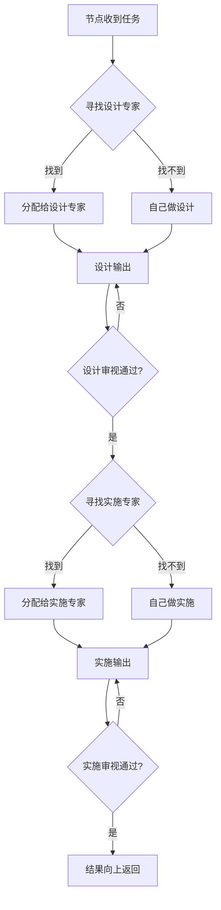
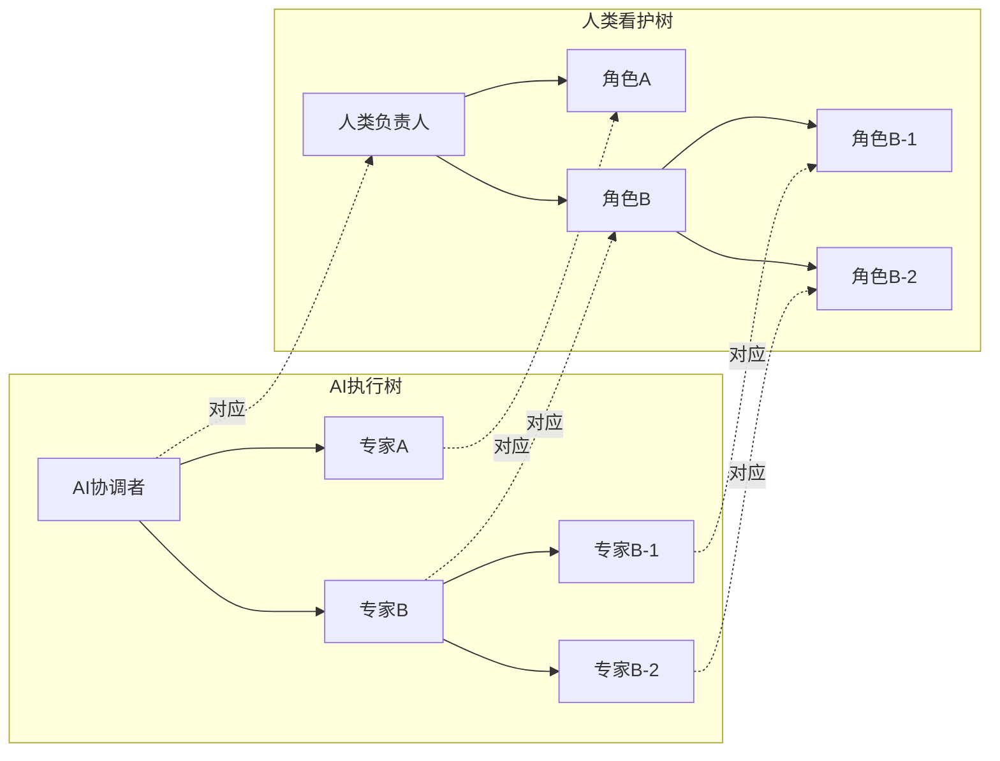
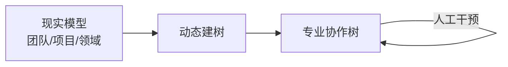
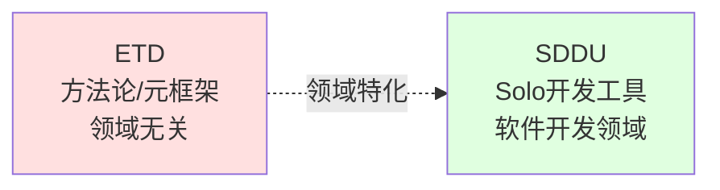

# ETD (Expert Tree Design)

> **AI执行 × 人类看护** | 一套动态构建专业协作树的方法论

ETD 是一套**领域无关**的方法论，为任意领域的复杂任务提供动态构建专业协作树的机制，使每个任务在谋定后动的执行与看护中完成。

---

## 命名释义

| 字母 | 含义 | 核心特点 |
|------|------|---------|
| **E**xpert | 专家分工 | 专业的事交给专业的 AI/人去做 |
| **T**ree | 动态协作树 | 根据现实模型动态生成，可生长凋落 |
| **D**esign | 设计先行 | 谋定而后动，思考规划先于行动 |

## 四大核心原则

1. **专业分工**：专业的事交给专业的 AI/人去做
2. **设计先行**：谋定而后动，思考规划先于行动
3. **双树并行**：AI 执行树 + 人类看护树，节点一一对应
4. **领域无关**：是方法论而非具体解决方案，不绑定特定领域

## 三大目标

| # | 目标 | 说明 |
|---|------|------|
| 1 | **动态建树** | 根据现实世界的团队、项目、领域，生成专业协作树 |
| 2 | **演进** | 树是活的，随现实变化生长凋落；非必须时允许人工输入，AI 需要时可介入 |
| 3 | **质量保障** | 每个节点谋定后动，AI 执行 + 人类看护双线并行 |

## 核心机制

### 树形递归分配

### 双树并行

### 活的树

树不是预设的固定结构，而是根据现实模型动态生成并持续演进：

## 领域适配示例

ETD 作为方法论，可适配多种领域：

| 领域 | 专家类型示例 | 任务类型示例 |
|------|-------------|-------------|
| **软件开发** | 产品经理、设计师、开发工程师、测试工程师... | 需求分析、架构设计、编码实现、测试验证... |
| **医疗诊断** | 医生、护士、技师、药师... | 问诊、检查、诊断、治疗... |
| **法律诉讼** | 律师、法官、书记员、专家证人... | 咨询、起诉、辩护、判决... |

## 与 SDDU 的关系

| | SDDU | ETD |
|---|------|-----|
| **定位** | Solo 开发者工具 | 方法论/元框架 |
| **架构** | 线性 6 阶段 | 动态树形结构 |
| **核心** | 一人全流程 | 专家分工看护 |
| **领域** | 软件开发专用 | 领域无关 |
| **关系** | ETD 在软件开发领域的具体实现 | SDDU 是 ETD 的一个领域特化 |

## Solo 与 Team

> Solo = 专家节点为空时的特例 | Team = 专家节点存在时的常态

不是模式切换，而是**引入专家节点**的自然过渡。

## 文档

- [需求挖掘报告](./.sddu/specs-tree-root/discovery.md) (v2.0.0)
- [产品规范](./.sddu/specs-tree-root/spec.md)（待编写）
- [技术规划](./.sddu/specs-tree-root/plan.md)（待编写）

## 开发说明

ETD 当前处于设计阶段，使用 `.sddu` 规范进行前期开发。待 ETD 成熟后，将切换到 `.etd` 规范实现自迭代。

## License

MIT License
