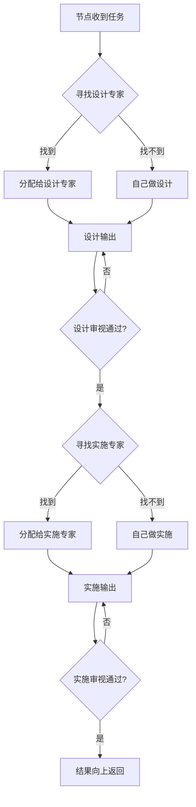

# ETD (Expert Tree Design)

> **AI执行 × 人类看护**

ETD 是独立于 SDDU 的团队协作平台，基于树形递归分配架构，实现专家分工看护和设计先行约束。

## 命名释义

| 字母 | 含义 | 核心特点 |
|------|------|---------|
| **E**xpert | 专家分工 | 专业的事交给专业的 AI/人去做 |
| **T**ree | 树形递归 | 树形递归分配架构 |
| **D**esign | 设计先行 | 所有实施必须先有设计 |

## 核心原则

1. **专业分工**：专业的事交给专业的 AI/人去做
2. **设计先行**：所有实施必须先有设计，设计未完成不允许进入实施
3. **双树并行**：AI 执行树 + 人类看护树，节点一一对应

## 架构概览

## 与 SDDU 的关系

| | SDDU | ETD |
|---|------|-----|
| 定位 | Solo 开发者工具 | 团队协作平台 |
| 架构 | 线性 6 阶段 | 树形递归分配 |
| 用户 | 独立开发者 | 3-5人小团队 |

## 快速开始

（待补充）

## 文档

- [需求挖掘报告](./.etd/specs-tree-root/discovery.md)
- [产品规范](./.etd/specs-tree-root/spec.md)（待编写）
- [技术规划](./.etd/specs-tree-root/plan.md)（待编写）

## License

MIT License